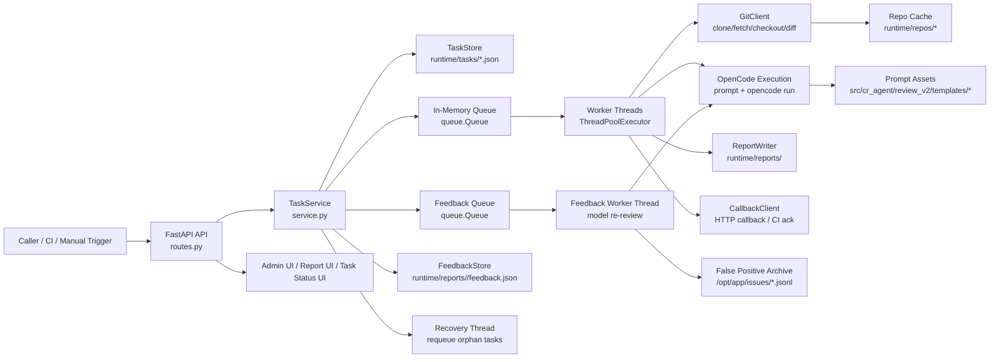
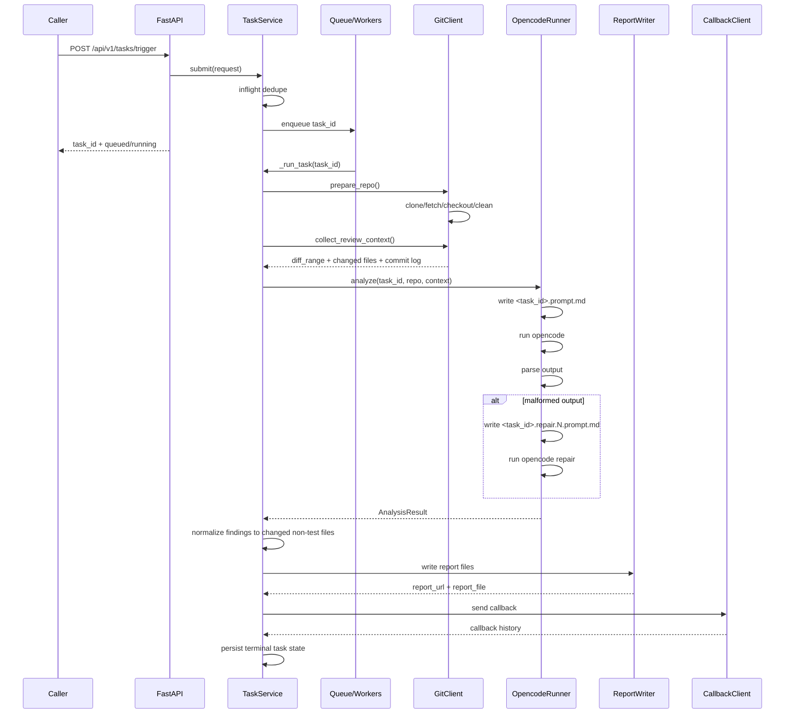
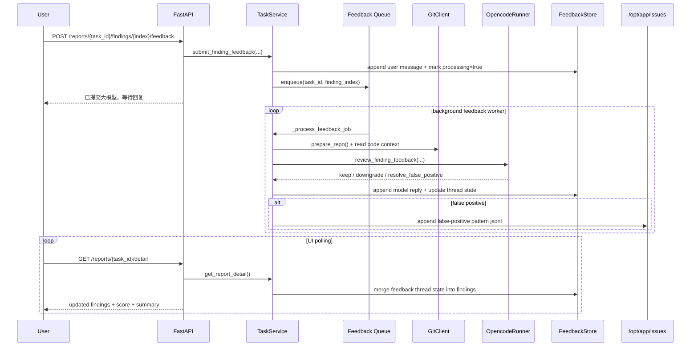
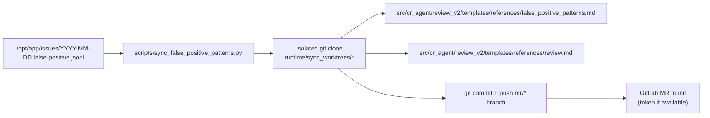

# CR Agent Architecture

## Overview

`cr_agent` is a single-process FastAPI service that accepts static analysis trigger requests, prepares a local git workspace, invokes `opencode`, normalizes the result, writes a report, and sends a callback.

It now also provides:

- an admin dashboard for operational metrics and running-task cleanup
- a task-status page for CI / users
- a report feedback workflow where users can challenge findings and the model re-reviews them asynchronously
- daily false-positive pattern extraction that can update the static-check skill and open an MR

## Components

## Runtime Flow

## Report Feedback Flow

## External Access Paths

- `POST /api/v1/ci/trigger`
  - CI trigger entrypoint
- `GET /task-status/{task_id}`
  - task lifecycle status page
- `GET /reports/{task_id}/index.html`
  - static report page
- `GET /reports/{task_id}/detail`
  - report detail JSON for UI polling
- `POST /reports/{task_id}/findings/{finding_index}/feedback`
  - asynchronous finding feedback submission
- `GET /admin`
  - admin dashboard
- `GET /api/v1/admin/metrics`
  - task count / p99 series
- `GET|DELETE /api/v1/admin/running`
  - running task list / bulk cleanup
- `GET /health`
- `GET /healthcheck.html`

## Persistence and Recovery

- Task metadata is persisted as JSON files under `runtime/tasks`.
- Reports are persisted under `runtime/reports/<task_id>`.
- Per-report feedback threads are persisted under `runtime/reports/<task_id>/feedback.json`.
- False-positive patterns are appended to `/opt/app/issues/YYYY-MM-DD.false-positive.jsonl`.
- A startup recovery pass requeues unfinished tasks.
- A background recovery thread scans `running` tasks and requeues or fails tasks that appear orphaned.
- Duplicate callbacks are suppressed by `callback_payload_digest`.

## Current Operational Limits

- Task queue and worker pool are in-memory within one service process.
- Feedback re-review queue is also in-memory within one service process.
- Horizontal scaling is not built in; multiple instances would need shared storage and coordination.
- `opencode` execution is the dominant throughput bottleneck, not the HTTP layer.
- Report feedback submission is asynchronous, but model re-review still consumes the same local `opencode` capacity.

## Daily False-Positive Sync

Behavior:

- The script scans the current day's false-positive archive.
- It clones a fresh isolated working directory instead of editing the running repo.
- It updates the CR v2 packaged false-positive patterns reference and, if needed, the packaged guideline asset.
- It pushes a new `mr/...` branch and attempts to create an MR to `init`.
- If no GitLab token is available, it falls back to printing a manual MR link.

## Logging Model

Key lifecycle logs are emitted with `task=<task_id>` so operators can trace:

- submit / dedupe / enqueue
- worker start / finish
- repo prepare and review-context collection
- opencode analyze start / finish
- parse failure and repair attempts
- report generation
- callback attempts and dedupe
- orphan recovery / timeout

For report feedback, additional logs matter:

- feedback submission accepted
- feedback worker start / finish
- opencode feedback review parse failures
- false-positive archive append
