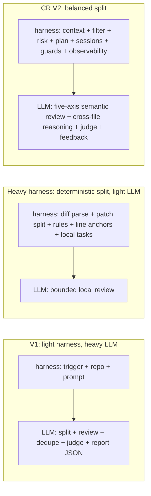
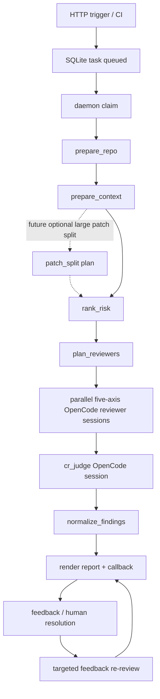
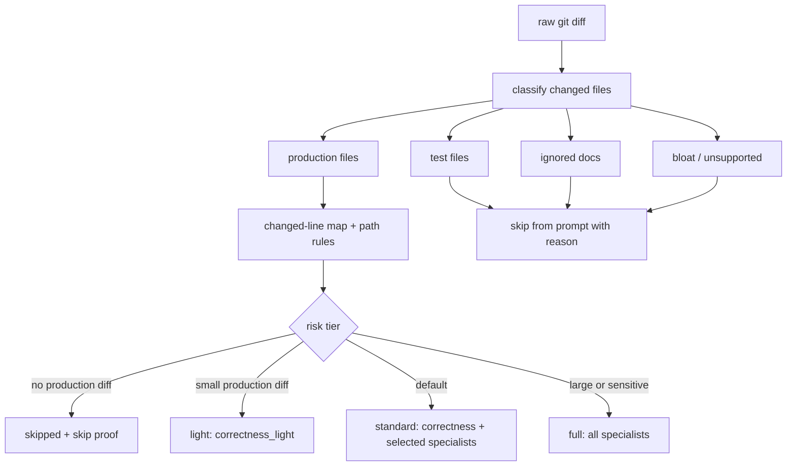

# CR Agent V2 Journey: From One Large LLM Review To Observable Multi-Reviewer Workflow

Chinese: [blog-cr-v2-journey.md](blog-cr-v2-journey.md)

## Summary

The most important CR Agent V2 change is the execution model. V1 asked one OpenCode session to do the whole review. V2 dynamically selects and runs parallel OpenCode reviewer sessions across five axes, then sends their structured outputs to an independent judge session.

This was not a prompt rewrite. It rebuilt the review harness around the parts that were hardest to operate: which files were reviewed, why files were skipped, which reviewer found an issue, which model and OpenCode session produced the output, where token/cost went, how feedback can re-review only the relevant finding, and whether the CI callback actually completed.

The central tradeoff is how much work belongs to the harness and how much belongs to the LLM. V1 had a light harness and gave splitting, review, de-duplication, judging, and JSON formatting to one session. A heavy deterministic approach does the opposite: pre-split the patch, apply rules, and ask the LLM to do small local checks. CR V2 chooses the middle path. The harness owns diff construction, filtering, risk tiering, reviewer planning, session orchestration, hard guards, and observability. The LLM owns semantic review, cross-file reasoning, judging, and feedback re-review.

In production shape, SQLite is the live state store, a daemon claims queued tasks, a LangGraph-style workflow drives repo/context/risk/reviewer/judge/finalize nodes, and OpenCode remains the LLM execution substrate. Every reviewer, judge, and feedback session has its own session id, model, raw log, token usage, and cost.

In four lines:

1. V2 moves from one review session to dynamic parallel five-axis reviewer sessions plus an independent `cr_judge`.
2. V2 adds deterministic filtering before LLM review: diff construction, production-file filtering, skip reasons, risk tier, reviewer plan, changed-line map, and rule matching.
3. V2 improves observability: model, session id, token/cost, raw log, status events, and callback result are recorded per session.
4. V2 improves extensibility: review axes, reviewer personas, language/file rules, and feature-spec references are prompt assets and rules, not scattered runner strings.

## Figure 1: Harness / LLM Boundary

## Why V2 Was Needed

V1's issue was not that the model could not review code. The issue was that the service layer had too few deterministic constraints and too little observability.

Common failure modes:

- One OpenCode session owned diff understanding, task planning, review, de-duplication, and final JSON formatting.
- Reports could show `0 files investigated` or "no findings" without making it obvious whether the review was truly clean or whether context/prompt/session parsing failed.
- Large sessions made latency and quality hard to attribute to tool calls, model inference, prompt design, JSON repair, or service parsing.
- Findings were addressed by array index, so de-duplication, sorting, feedback, or multi-reviewer merging could point a discussion at the wrong finding.
- Token usage and runtime were visible only as totals, not per reviewer or judge.
- User operations needed stable state: discuss, re-review, mark false positive, mark human non-fix, and re-ack CI after all findings are resolved.

V2 makes the system answer operational questions:

- Which production files entered review?
- Which files were filtered out, and why?
- Was this task `light`, `standard`, or `full`?
- Which reviewers ran in parallel, and which were required?
- Which model and OpenCode session did each reviewer use?
- How much token/cost did each session consume?
- Which candidates did the judge accept or reject?
- Did feedback re-review only the relevant finding context?
- Was the callback sent and acknowledged?

## External Design Inputs

### Deterministic Harnesses

Strong deterministic review harnesses show one important lesson: do not give all hard constraints to the model. A service can and should parse diffs, filter files, enforce extension allowlists, preserve line anchors, bound concurrency, and explain skips before any LLM call.

CR V2 adopted that part:

- File filtering and skip reasons are service-owned.
- Path/language/file-type rules are matched deterministically before prompt rendering.
- Changed-line anchors are enforced by the service.
- Audit artifacts remain private; public reports expose only sanitized results.

CR V2 does not use per-file review as the default execution model. Real review issues often cross file boundaries: API provider/consumer compatibility, config/code mismatch, callback state machines, DB schema and mapper changes, worker lease logic, and retry semantics. Over-splitting forces each session to rebuild context and can hide cross-file causality.

The longer-term bet is also important: as LLM capability grows, an overly strong harness can become a ceiling. The harness should own boundaries, evidence, budgets, and state. It should not pre-decide every review path the model is allowed to reason through.

### Cloudflare-Style Reviewer Fanout

The pattern closest to CR V2 is risk-ranked specialist reviewer fanout followed by a judge/coordinator pass:

- Reviewers can focus on correctness, security, API contracts, config/release risk, and performance.
- Small diffs do not need full fanout.
- Sensitive paths and large diffs get more reviewers.
- Each reviewer is an independent OpenCode session, so failures are isolated.
- The judge is a final LLM session responsible for precision, recall, de-duplication, and quality filtering.

CR V2 is therefore best described as Cloudflare-style fanout plus deterministic guardrails.

### Reusing A Task-Runner Pattern

V2 also reuses a proven task-runner pattern:

- SQLite as source of truth.
- HTTP trigger only enqueues work.
- A daemon claims, requeues, stops, and recovers tasks.
- OpenCode config is generated per checked-out project instead of relying on global config.
- Provider/model routing is controlled by service config.
- Token/cost is recorded at session granularity.
- Recent/progress pages aggregate live state from SQLite.

## V2 Architecture

Node responsibilities:

- `prepare_repo`: check out the repository and resolve commit/diff range.
- `prepare_context`: build the filtered production diff, changed-line map, matched rules, feature references, and private audit artifacts.
- `patch_split`: a future optional node for very large patches. It should split into semantic bundles only when context or budget requires it.
- `rank_risk`: compute `skipped`, `light`, `standard`, or `full`.
- `plan_reviewers`: persist required and optional reviewers.
- `run_reviewers`: run five-axis OpenCode reviewer sessions with bounded parallelism.
- `judge_findings`: run `cr_judge` over reviewer candidates.
- `normalize_findings`: enforce changed-line anchors, schema, severity, de-duplication, and reviewer attribution.
- `finalize_task`: render report artifacts and send callback.
- `feedback`: run a targeted re-review for one finding instead of restarting the whole workflow.

## Deterministic Pre-Filtering

V2 does not let the LLM decide the review boundary.

Files are classified as:

- `production`: reviewable production files.
- `test`: test files; excluded from reviewer prompts.
- `ignored`: README and docs.
- `bloat/unsupported`: lockfiles, minified assets, source maps, binary/archive files, generated dumps, jars/classes, and unsupported extensions.

Risk tiers:

- `skipped`: no production diff. Requires skip proof.
- `light`: small production diff. Runs `correctness_light`.
- `standard`: default production path. Runs required `correctness` and selected specialists.
- `full`: large, truncated, or sensitive diff. Runs all specialists.

## Observability

Every review run produces structured state:

- task stage and event stream
- reviewer plan
- reviewer run status
- OpenCode session id
- selected provider/model
- raw log path
- parsed JSON output
- input/output/reasoning/cache tokens
- cost
- duration
- callback retry state

That makes "no findings" different from "no review happened". A passed task must have successful required reviewer sessions and a final judge session. A skipped task must show proof that the diff had no reviewable production file.

## Finding Feedback

V2 makes findings operational objects rather than array positions.

Each finding has a stable `finding_id`, source reviewer, and source reviewer run. User feedback creates a standalone feedback session linked to that finding and reviewer. The service does not re-run the full workflow unless explicitly retriggered.

Feedback can:

- keep the finding open
- mark it model-resolved
- mark it human non-fix
- mark it false positive
- recompute whether all findings are resolved
- send an idempotent callback when the task becomes passed

## Extensibility

The system is intentionally extensible at the prompt/rule layer:

- reviewer axes live in `reviewer_profiles.py`
- persona files live under `templates/references/personas`
- common review guidance lives under `templates/references`
- language and file-type rules live under `templates/references/rules`
- feature references are discovered from tracked repository files

Adding a new reviewer or rule should usually mean adding a profile/reference asset and deterministic path trigger, not editing the OpenCode runner.

## Why Patch Split Is Optional

Large patches may eventually need a pre-node that splits the diff before review. But it should be optional and semantic, not default per-file splitting.

Default per-file splitting is precise but expensive:

- each session rebuilds context
- cross-file bugs become harder to detect
- judge quality depends on reconstructing relationships after the fact
- the harness over-constrains the model

CR V2 keeps the default as multi-axis review over a bounded production diff. Patch splitting should activate only when the diff exceeds context, runtime, or cost limits.

## References

- [Cloudflare: AI Code Review](https://blog.cloudflare.com/ai-code-review/)
- [Uber: uReview](https://www.uber.com/us/en/blog/ureview/)
- [Alibaba open-code-review](https://github.com/alibaba/open-code-review)
- [CR v2 design](design-cr-v2-cloudflare-reuse.md)
- [CR v2 roadmap](cr_v2_roadmap.md)
