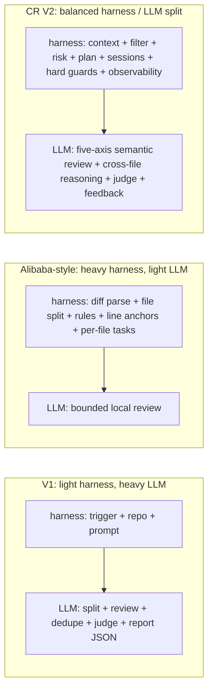
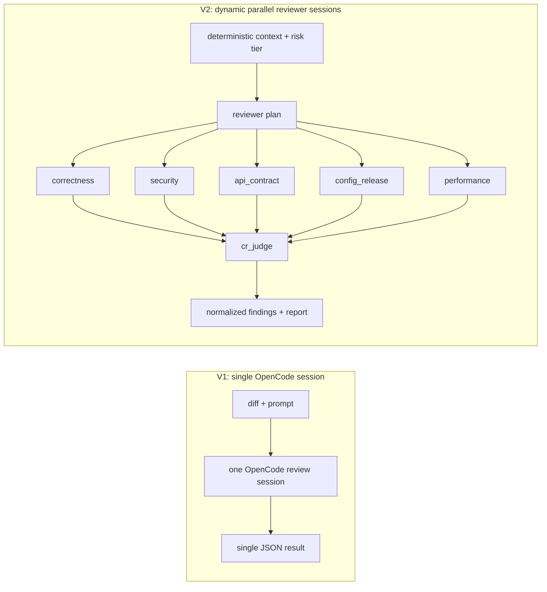
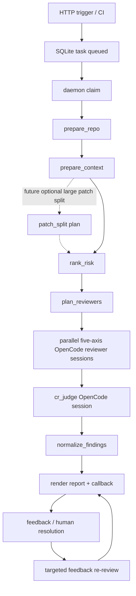
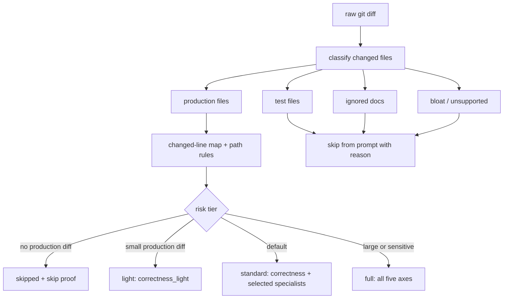
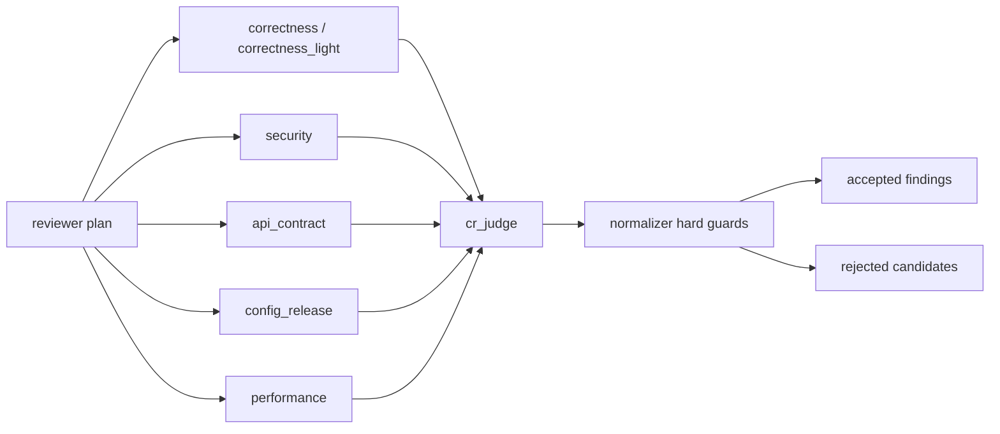
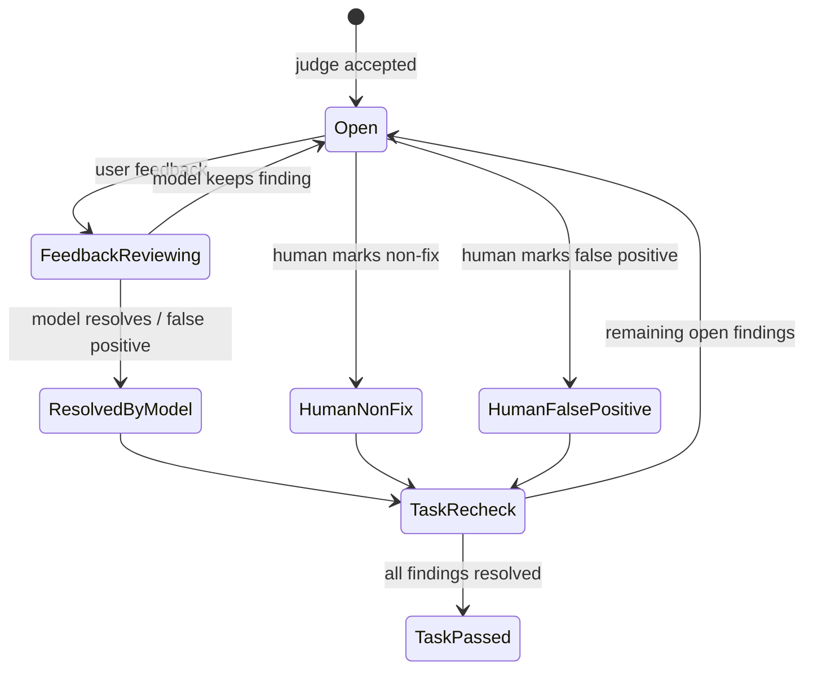
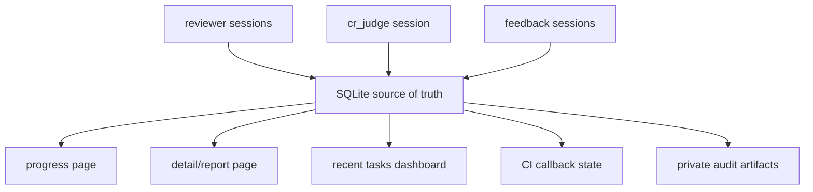
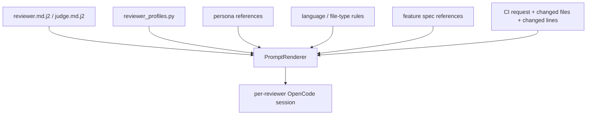
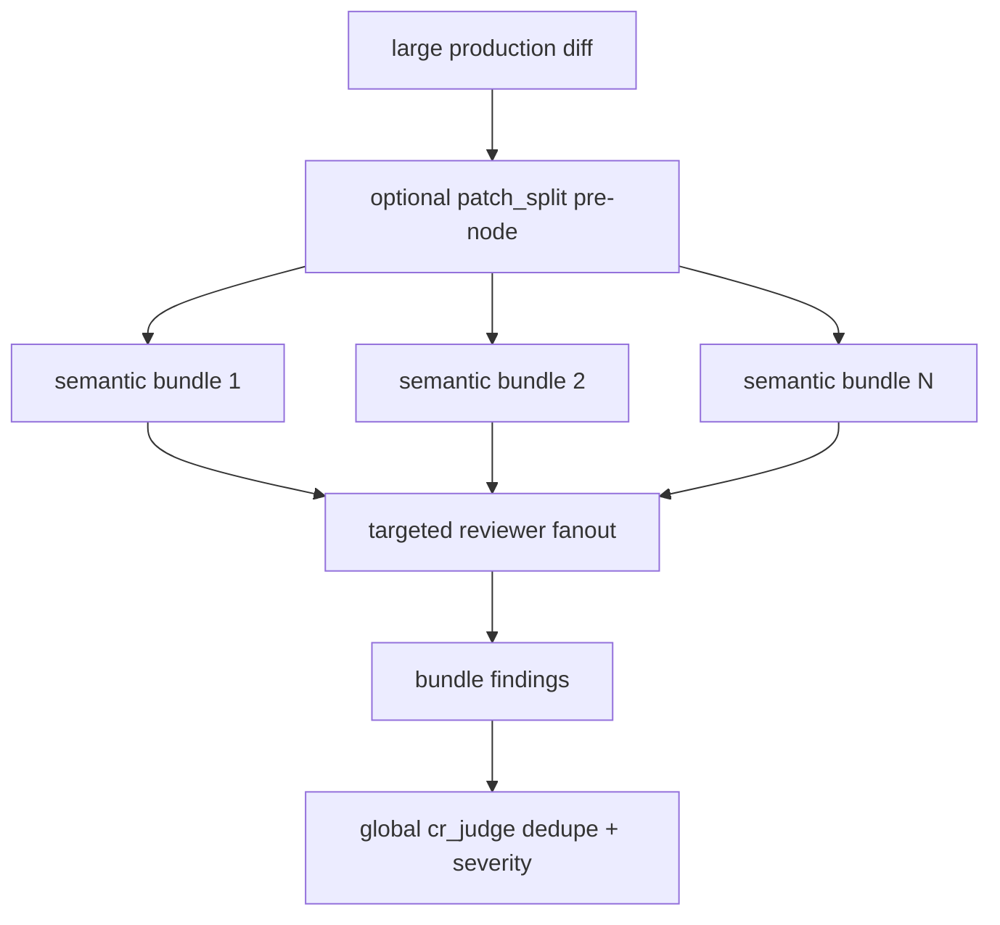

# CR Agent V2 Journey: 从单次大模型审查到可观测的多 Reviewer 工作流

English: [blog-cr-v2-journey.en.md](blog-cr-v2-journey.en.md)

## 摘要

CR Agent V2 最重要的变化，是从 V1 的“单个 OpenCode session 完成全部 review”，升级为 V2 的“动态选择、并行运行的五轴 OpenCode reviewer sessions”。这不是一次 prompt 改写，而是代码审查执行模型的重建。

这次升级的目标不是简单换一个更强模型，而是把代码审查系统中最容易出问题的部分工程化：哪些文件被审查、为什么跳过、哪个 reviewer 发现了问题、哪个模型和 session 产生了输出、token/cost 为什么这么高、用户反馈后如何只复审相关 finding、CI callback 是否真正完成。

V2 的核心取舍，是在 **harness 负责什么** 和 **LLM 负责什么** 之间重新划线。V1 的 harness 很轻，把拆分、审查、归并、判断大多交给一个 LLM session；Alibaba Open Code Review 更接近另一端，harness 很重，先确定性拆到 per-file/per-unit，再让 LLM 做较轻的局部判断。CR V2 选择中间路线：harness 负责 diff、过滤、risk tier、reviewer plan、session orchestration、hard guard 和 observability；LLM 负责五轴 reviewer 的语义判断、跨文件理解、judge 归并和 feedback re-review。

最终落地形态是：SQLite 作为实时状态源，daemon 从队列 claim 任务，LangGraph 风格的 workflow 节点驱动 repo/context/risk/reviewer/judge/finalize，OpenCode 作为 LLM 执行 substrate，每个 reviewer/judge/feedback 都有独立 session id、model、raw log、token 和 cost 记录。

如果只用四句话概括 V2：

1. **执行模型变化**：从 V1 单 session 全包，变成 V2 按风险动态选择的并行五轴 reviewer sessions，再由独立 `cr_judge` 汇总。
2. **确定性前置**：LLM 前先做 diff construction、生产文件过滤、skip reason、risk tier、reviewer plan、changed-line map 和 rule matching。
3. **可观测性增强**：每个 reviewer/judge/feedback session 都记录 model、session id、token/cost、raw log、状态事件和 callback 结果。
4. **扩展性增强**：review axis、reviewer persona、语言/文件类型规则、feature spec reference 都通过模板和规则资产接入，而不是散落在业务代码里。

### 图 1: Harness 与 LLM 的职责边界

## 阅读路线

这篇文章按五层展开：

1. **背景层**：为什么 V1 的单 OpenCode session 模式到达上限。
2. **方案层**：为什么选择 Cloudflare-style 五轴 fanout，同时保留 Alibaba-style deterministic guardrails。
3. **执行层**：V2 workflow 如何从 trigger 走到 reviewer、judge、report 和 feedback。
4. **能力层**：deterministic filtering、observability、prompt/rule extensibility 分别解决什么问题。
5. **演进层**：为什么未来的大 patch split 应该是可选 pre-node，而不是默认 per-file 切分。

### 图 2: V1 到 V2 的执行模型变化

## 1. 为什么需要 V2

V1 的问题不是“模型不会 review”，而是“服务层缺少足够的工程约束和观测能力”。

在真实pre-release CR 场景中，我们遇到过几类典型问题：

- 单个 OpenCode session 承担全部职责：理解 diff、决定关注点、审查、去重、格式化输出都混在一起，harness 只是轻量调用壳，难以并行，也难以隔离失败。
- 报告显示 `0 files investigated` 或 `未发现问题`，但很难判断是真的没有问题，还是 diff/context/prompt/session 失败。
- 一个大 OpenCode session 同时负责理解 diff、拆任务、审查、归纳输出，失败后很难定位是工具调用、模型推理、prompt、JSON 格式还是服务解析的问题。
- finding 用数组下标做身份，一旦 dedupe、排序、feedback 或多 reviewer 合并，讨论和复审很容易指向错误对象。
- token usage 和耗时只能看总量，无法解释是哪个 reviewer、哪个 judge、哪个 feedback session 花掉了成本。
- 用户对 finding 的操作需要稳定状态机：讨论、复审、人工标记 non-fix/false positive、全部 resolved 后重新 callback。

所以 V2 的目标不是“让 LLM 多说一点”，而是让 CR 系统回答这些问题：

- 本次到底有哪些生产文件进入审查？
- 哪些文件被过滤，过滤原因是什么？
- 当前是 light、standard 还是 full 模式？
- 哪些 reviewer 并行运行，哪个 required，哪个 optional？
- 每个 reviewer 用了哪个模型、哪个 OpenCode session、多少 token、多少钱？
- judge 接受或拒绝了哪些候选 finding，理由是什么？
- feedback 复审是否只重跑了原 finding 对应的 reviewer 语境？
- callback 是否真的被发送并成功 ack？

## 2. 外部方案给我们的启发

### Alibaba: harness 很强，但 per-file review 有代价

Alibaba Open Code Review 的重要启发是：不要把所有硬约束都交给模型。它代表了另一种取舍：harness 承担更多确定性拆解和约束，LLM 被限制在更小、更局部的 review task 中。

它在 LLM 前做了很多确定性处理：git ref 校验、diff 解析、文件过滤、扩展名 allowlist、path rule 匹配、二进制/删除文件跳过、line anchor 解析、并发和 timeout 控制。这些能力对于线上 CR 非常重要，因为它们能解释“为什么审查了这些文件”和“为什么某个文件没审查”。

但我们没有直接采用 per-file review 作为默认模型。原因是代码审查中的很多真实问题是跨文件的：API provider/consumer 契约、配置和代码不一致、回调状态机、DB schema 与 mapper、并发 worker 与任务 lease。这些问题如果按文件拆得太碎，每个 session 都要重建上下文，也更容易错过跨文件因果。

还有一个更长期的判断：随着 LLM 能力持续增强，过强的 harness 可能从“护栏”变成“天花板”。如果 harness 过早把问题切成很小的局部 task，模型就失去了自己规划审查路径、建立跨文件关联、发现非预设问题类别的空间。近期一些 agent 系统的演进方向也在减少过度脚手架，把更多 reasoning space 交还给模型。对 CR 来说，这意味着 harness 应该负责边界、证据、预算和状态，而不是替模型规定所有审查路径。

因此我们复用了 Alibaba 式的确定性约束，而不是复用它偏重 harness 的默认执行切分方式：

- 文件过滤和 skip reason 服务层负责。
- path/language/file-type rule 在 prompt 前确定性匹配。
- changed-line anchor 由服务层兜底校验。
- coverage/audit artifact 私有保存，报告只展示 sanitized 结果。

### Cloudflare: 更适合我们的 reviewer fanout

Cloudflare 的 AI Code Review 更接近我们想要的工作流：先做风险分层，再启动多个 specialist reviewer，最后由 coordinator/judge 做归并、去重和质量过滤。

这条路的优点是：

- reviewer 可以按职责收窄：correctness、security、api_contract、config_release、performance。
- 小 diff 不必 full fanout，大 diff 或敏感路径才启动更多 reviewer。
- 每个 reviewer 都是独立 OpenCode session，失败隔离更好。
- judge 是 final LLM session，负责 precision/recall 取舍，而不是让每个 reviewer 的输出直接进报告。

CR Agent V2 最终主要采用这个方向：Cloudflare-style fanout + deterministic guardrails。

### comain/unit-test-agent: 可复用的任务系统和 OpenCode 运行经验

公开的 [comain/unit-test-agent](https://github.com/comain/unit-test-agent) 已经沉淀了一套可复用的任务运行经验：SQLite 任务队列、daemon claim/requeue/stop、OpenCode per-turn config、model/provider selection、session recorder、recent/progress dashboard、token usage 读取和 callback 管理。

CR V2 直接复用或改造了这些思路：

- SQLite 是 source of truth。
- HTTP trigger 只入队，daemon 后台 claim。
- reviewer session 不用全局 OpenCode 配置，而是 per-turn `opencode.json`。
- model/provider chain 由服务配置统一控制。
- token/cost 记录到 session 粒度。
- recent/progress 页面从 SQLite 实时聚合。
- daemon 支持 stop/requeue，避免卡死任务只能人工改库。

## 3. V2 的架构形态

V2 的关键变化是把 CR 拆成一条可观测 workflow：

### 图 3: CR V2 端到端 workflow

每个节点都有明确职责：

- `prepare_repo`: checkout repo，确定 commit 和 diff range。
- `prepare_context`: 构造过滤后的 production diff、changed lines、matched rules、feature spec references，并写私有 audit artifact。
- `patch_split`（未来可选）: 只在大 patch 超过上下文或审查预算时启用，把变更拆成少量语义 bundle；默认不按文件强拆，避免丢失跨文件问题。
- `rank_risk`: 按生产文件数、changed lines、diff size、路径触发器和截断状态决定 `skipped/light/standard/full`。
- `plan_reviewers`: 生成 reviewer plan，并持久化 required/optional reviewer。
- `run_reviewers`: 按 risk tier 并行启动五轴 OpenCode reviewer session，记录 session id、model、tokens、cost、raw log、结构化输出。
- `judge_findings`: 独立 `cr_judge` session 汇总 reviewer candidate，做去重、证据校验、severity 归一和中英文修正。
- `normalize_findings`: 服务层硬约束兜底，确保 finding 必须锚定 changed line，必须有 reviewer attribution。
- `finalize_task`: 生成 report/result，发送 CI callback。
- `feedback`: 用户对单个 finding 反馈后，只启动对应 finding 的定向复审，不重跑全部 workflow。

## 4. 确定性前置: 不让 LLM 决定该审什么

V2 的一个原则是：LLM 可以判断代码风险，但不应该决定审查边界。

### 4.1 文件先分类，再进入审查

服务层先把文件分成几类：

- `production`: 可审查生产文件。
- `test`: 测试文件，不进入 reviewer prompt。
- `ignored`: README、docs 等默认忽略文档。
- `bloat/unsupported`: lockfile、minified、source map、图片、压缩包、二进制、jar/class、dump 等。

### 4.2 风险分层决定 reviewer plan

然后按确定性规则选择模式：

- `skipped`: 没有生产 diff，必须有 skip proof，不能渲染成“已审查通过”。
- `light`: 小生产 diff，只跑 `correctness_light`。
- `standard`: 默认生产路径，跑 required `correctness`，再按触发器加少量 specialist。
- `full`: 大 diff、context 截断或敏感路径，跑 required correctness 和全部 specialist。

这样做的好处是报告可以解释自己：不是“模型觉得没必要看”，而是“服务根据这些文件和规则选择了这个模式”。

### 图 4: Deterministic pre-filter 与 risk tier

## 5. Reviewer Fanout: 专家化但不失控

### 5.1 五轴 reviewer

V2 当前的 reviewer axis 包括：

| Reviewer | 关注点 |
| --- | --- |
| `correctness_light` | 小 diff 的 changed-line correctness、边界输入、明显架构/安全/性能红旗 |
| `correctness` | 正确性、状态流转、空值、边界、重试、幂等、并发、维护性导致的真实 bug |
| `security` | 授权、输入校验、注入、SSRF、路径穿越、命令执行、敏感数据、callback/webhook |
| `api_contract` | Dubbo/RPC/API/schema/report/callback 契约兼容性 |
| `config_release` | 配置默认值、环境覆盖、部署文件、supervisor、scheduler、rollback、验证缺口 |
| `performance` | 无界循环、N+1、同步远程调用、worker/backpressure、token/cost/runtime |

每个 reviewer 都共享同一个外层 JSON-only 契约，但通过 profile overlay 和 reference files 收窄职责。finding 必须满足一个共同硬约束：问题必须由 inline diff 的 changed line 直接支撑；可以读取未改代码、调用链、依赖或配置来验证影响，但 anchor 必须落在 changed line 上。

### 图 5: 五轴 fanout 与 judge 汇总

## 6. Judge: 不是本地 if-else，而是 final LLM session

早期我们考虑过让服务直接把 reviewer findings 合并进报告。但实际效果不稳定：不同 reviewer 可能重复、severity 不一致、证据强弱不同，甚至输出英文 finding。

V2 把 `cr_judge` 作为独立 OpenCode session：

- 输入成功 reviewer 的结构化输出、risk metadata、changed-line map 和 feature spec references。
- 先最大化 recall，收集候选问题。
- 再按 schema、scope、evidence、precision、confidence、dedupe、severity、gate 逐层过滤。
- 输出 `accepted_findings` 和 `rejected_candidates`。
- 保留 `source_reviewer` 和 `source_review_run_id`，用于后续定向 feedback re-review。

服务层的 normalizer 不负责“发挥”，只负责硬约束兜底：JSON schema、changed-line anchor、文件范围、severity、去重和 attribution。

## 7. Finding 从报告文本升级为可操作对象

V1 中 finding 更接近最终报告里的数组元素。V2 中 finding 是一等对象。

这带来了几个变化：

- finding 有稳定 ID，不再依赖数组下标。
- finding 保存来源 reviewer 和 reviewer run id。
- feedback session 能链接回原始 finding、原始 reviewer 和原始 OpenCode session。
- 用户可以对单个 finding 做 feedback、人肉标记 non-fix/false-positive。
- 当所有 finding 都被复审或人工解决后，任务可以重新标记 passed，并触发幂等 CI callback。

这让报告不再是“静态页面”，而是一个 finding lifecycle 的入口。

### 图 6: Finding lifecycle

## 8. 可观测性: 让问题可以被定位

V2 的很多工作其实不是为了“更聪明”，而是为了“能排查”。

现在 progress/report/recent 页面都能回答：

- 当前任务处在哪个 stage？
- reviewer plan 是什么？
- 每个 reviewer 是否 running/success/failed？
- 每个 reviewer 的 OpenCode session id 是什么？
- 每个 reviewer 用了哪个 model？
- reviewer、judge、feedback 各自用了多少 token 和 cost？
- cache-read/cache-write token 是否异常？
- task callback 是否成功 ack？
- feedback re-review 是否有独立 progress page？

### 图 7: 观测数据从 session 汇聚到页面

## 9. 扩展性: Prompt 不是散落在代码里的字符串

V2 把 prompt construction 收敛到模板和 reference files：

- reviewer prompt: `reviewer.md.j2`
- judge prompt: `judge.md.j2`
- feedback prompt: 独立 feedback 模板
- persona/reference/rules: `templates/references`
- reviewer profile: `reviewer_profiles.py`

这样做的目的有两个：

第一，prompt 可以像代码一样 review。不同 reviewer 的职责、tool policy、finding 要求可以集中管理。

第二，规则可以动态扩展。比如 Java、Dubbo provider API、mapper XML、config/release、security checklist 都可以作为 reference 注入，而不是在 runner 里硬编码自然语言。

### 图 8: Prompt 资产的扩展点

## 10. Report 设计: 不是只说“过了/没过”

V2 report 的目标是同时服务三类人：

- 业务开发：快速看有没有 blocking issue，怎么修。
- 平台维护者：看 reviewer/judge/session/token/cost，排查模型和服务问题。
- CI/CI：读取结构化 result，做 callback 和 gate 判断。

因此 report/progress 分工是：

- status page 只展示轻量状态和文档入口，不展示 finding 列表。
- progress page 展示 reviewer plan、并行状态、model、session、token/cost、judge 和 feedback session。
- final report 展示按 severity 分组的 finding、blocking/non-blocking、review sessions、feedback sessions。
- recent page 展示最近任务、finding 数、severity 分层、combined cost/token 和入口。

## 11. 我们最终选择的平衡点

CR V2 最重要的平衡，是 harness 和 LLM 的职责分配。

V1 的问题是 harness 太轻：服务只负责触发和收集结果，LLM session 需要自己完成拆解、判断、汇总和格式化。这个模式依赖模型能力，简单直接，但一旦 diff 变大、session 卡住、输出为空或误判，就很难定位到底是上下文、工具、模型还是业务规则的问题。

Alibaba-style 的问题在另一端：harness 很强，先把 diff 拆成更小、更确定的 review task，LLM 只做局部判断。这提升了覆盖可解释性和行级精度，但默认 per-file/per-unit 切分会削弱跨文件理解，也会让每个 session 反复重建上下文。更重要的是，随着模型能力增长，过强 harness 会变成反方向约束：它把模型限定在 harness 预设的文件边界和问题类型里，降低了模型利用更强 planning、tool use 和 cross-file reasoning 的空间。

CR V2 的目标是取中间值：

- harness 负责确定性边界：diff、文件过滤、risk tier、reviewer plan、changed-line anchor、session orchestration、schema/anchor hard guards、progress/report/callback。
- LLM 负责语义判断：五轴 reviewer 的 bug reasoning、跨文件关联、spec mismatch 判断、judge 归并、feedback re-review。
- harness 是 guardrail，不是 reviewer 本身；它应该约束输入边界、输出契约和可观测性，而不是替模型预先穷举所有审查路径。
- 默认不做 per-file 强拆，而是用五轴并行 reviewer 保留跨文件理解。
- 大 patch 未来可以增加可选 `patch_split` pre-node，但它应该按语义 bundle 拆分，只在超出上下文或预算时启用。
- finding 是可操作对象，feedback 进入状态机；report 是派生视图，不是唯一状态源。

一句话概括：V2 的主线不是“harness 替代 LLM”，也不是“LLM 包办一切”，而是在 harness 的确定性控制和 LLM 的语义判断之间找到一个可运营的边界。

## 12. 下一步

V2 目前已经完成核心闭环，但还有几个方向值得继续：

- 更系统地沉淀 false-positive feedback，自动生成 MR 更新 prompt reference，而不是改本地运行源码。
- 针对高频业务域补充 domain-specific reference，例如 WMS、TMS、ERP、Dubbo API 兼容性。
- 优化 token/cost：根据 diff/risk 动态选择 reviewer 和模型，进一步利用 cache-read。
- 对超大 patch 增加可选 `patch_split` pre-node，先生成少量语义 bundle，再在每个 bundle 上运行 reviewer fanout 或 targeted reviewer，避免单 prompt 过大，同时保留跨文件关联。
- 增强 report 中 judge rejected candidates 的可解释性，帮助平台调 prompt 和规则。
- 把 provider/model health 暴露到运维页面，避免只在单个 task log 中发现供应商异常。

### 图 9: 未来可选 large-patch split

## 13. References

### External references

- [Cloudflare: Orchestrating AI Code Review at scale](https://blog.cloudflare.com/ai-code-review/). 主要参考其 coordinator + specialist reviewers + OpenCode runtime/plugin 的整体方向。
- [Uber: uReview: Scalable, Trustworthy GenAI for Code Review at Uber](https://www.uber.com/us/en/blog/ureview/). 主要参考其 multi-stage pipeline、preprocessing、filtering、validation 和 deduplication 思路。
- [Alibaba open-code-review GitHub repository](https://github.com/alibaba/open-code-review). 主要参考其 deterministic diff processing、file filtering、rule matching、line-level precision 和 precision-first 取舍。
- [Alibaba Open Code Review project site](https://alibaba.github.io/open-code-review/). 用于理解其产品定位和 agent-native code review 介绍。

### Internal CR v2 references

- [README.md](../README.md): 当前 CR v2 能力、workflow semantics、prompt construction、report/progress surfaces。
- [docs/cr_v2_roadmap.md](cr_v2_roadmap.md): 外部方案调研、Cloudflare/Alibaba/Uber 取舍和 V2 roadmap。
- [docs/spec-cr-v2-cloudflare-reuse.md](spec-cr-v2-cloudflare-reuse.md): CR v2 phase 1 spec。
- [docs/design-cr-v2-cloudflare-reuse.md](design-cr-v2-cloudflare-reuse.md): CR v2 design，包括 SQLite、LangGraph-style workflow、基于 [comain/unit-test-agent](https://github.com/comain/unit-test-agent) 的 runtime reuse、review/comment feedback。
- [docs/plan-cr-v2-cloudflare-reuse.md](plan-cr-v2-cloudflare-reuse.md): 实施计划和 rollout verification 任务拆分。
- [docs/decisions/ADR-001-cr-v2-sqlite-source-of-truth.md](decisions/ADR-001-cr-v2-sqlite-source-of-truth.md): SQLite source-of-truth 决策。
- [docs/decisions/ADR-002-cr-v2-langgraph-reference-runtime.md](decisions/ADR-002-cr-v2-langgraph-reference-runtime.md): workflow 和 [comain/unit-test-agent](https://github.com/comain/unit-test-agent) runtime reuse 决策。
- [docs/decisions/ADR-003-cr-v2-context-preparation-prompts.md](decisions/ADR-003-cr-v2-context-preparation-prompts.md): context preparation 和 prompt construction 决策。
- [docs/decisions/ADR-004-cr-v2-private-audit-artifacts.md](decisions/ADR-004-cr-v2-private-audit-artifacts.md): public report 与 private audit artifact 的边界。

## 14. 结语

CR Agent V2 的旅程说明，AI code review 的难点不只是“调用一个强模型”。真正困难的是把模型放进一个可控、可观测、可反馈、可恢复的工程系统里。

当系统能清楚回答“审了什么、为什么这么审、谁发现的问题、为什么接受或拒绝、花了多少成本、失败后怎么恢复”时，LLM 才能从一次性的审查脚本变成可长期运营的 CI reviewer。
