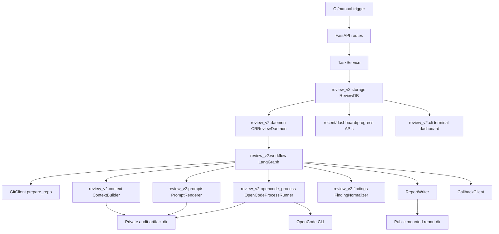
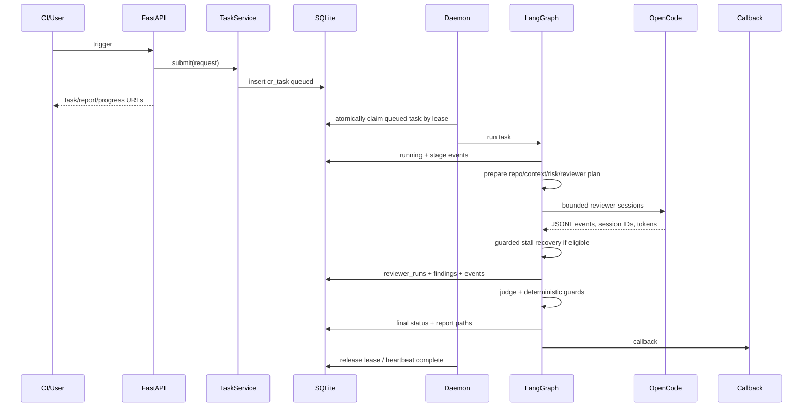
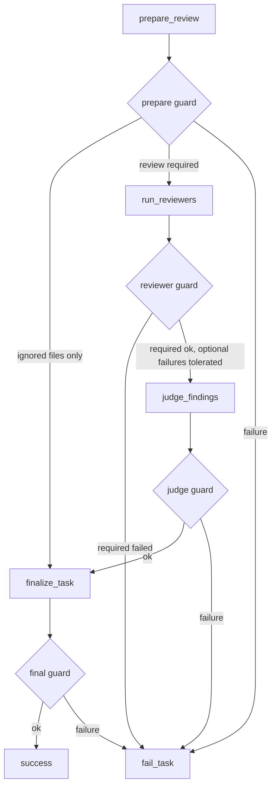

# Design Overview And Detail: CR V2 Cloudflare-Style Review Orchestration

## Status

Draft for design review. Derived from `docs/spec-cr-v2-cloudflare-reuse.md`.

This is confirmed non-Ticket tool work. The affected repo is only `cr_agent`, so the repo detail design is folded into this document.

## Table Of Contents

- [1. Scope](#1-scope)
  - [Goals](#goals)
  - [Non-Goals](#non-goals)
- [2. Architecture Overview](#2-architecture-overview)
  - [High-Level Design](#high-level-design)
  - [System Ownership](#intra-system-relationships-and-cooperation)
  - [Data Dependency Flow](#data-dependency-flow)
- [3. Review Workflow](#3-review-workflow)
  - [Key Process Flow](#key-process-flow)
  - [LangGraph Workflow Design](#langgraph-workflow-design)
- [4. LLM Runtime And Model Routing](#4-llm-runtime-and-model-routing)
  - [Reference Task Runner Source Map](#reference-task-runner-source-map)
  - [Model Selection And OpenCode Config](#model-selection-and-opencode-config)
- [5. Data, API, And Report Contracts](#5-data-api-and-report-contracts)
  - [SQLite Schema](#sqlite-schema)
  - [API And Schema Changes](#api-and-schema-changes)
- [6. Repo Implementation Plan](#6-repo-implementation-plan)
  - [Changes In This Repo](#changes-in-this-repo)
  - [V1 Code To Remove Or Retire](#v1-code-to-remove-or-retire)
  - [Key Data Structures And Abstractions](#key-data-structures-and-abstractions)
- [7. Operational Plan](#7-operational-plan)
  - [Capacity, Reliability, And Security](#capacity-reliability-and-security)
  - [Failure-Mode Handling](#failure-mode-handling)
  - [Rollout Plan And Strategy](#rollout-plan-and-strategy)
  - [Verification Plan](#verification-plan)
  - [Repo-Local Implementation Constraints](#repo-local-implementation-constraints)
  - [Repo-Local Risks And Verification](#repo-local-risks-and-verification)
- [8. Review Closure](#8-review-closure)
  - [Key Design Tradeoffs](#key-design-tradeoffs)
  - [Design Review Dispositions](#design-review-dispositions)
  - [First-Principles Check](#first-principles-check)
  - [Changelog](#changelog)

## 1. Scope

### Goals

- Replace the one-shot CR review path with a queued daemon execution model. Trigger APIs insert durable SQLite tasks; a CR daemon claims queued tasks and runs a LangGraph workflow that performs deterministic context preparation, risk tiering, bounded specialist OpenCode reviewer sessions, a judge pass, finding persistence, report rendering, and callback.
- Use SQLite as the source of truth for CR tasks, reviewer runs, findings, finding events, feedback sessions, token usage, runner heartbeats, and dashboard/recent-job queries.
- Copy/adapt proven [comain/unit-test-agent](https://github.com/comain/unit-test-agent) modules for OpenCode spawning, JSONL stream parsing, token accounting, model routing/config generation, task events, and progress/dashboard patterns.
- Store every OpenCode reviewer session ID, raw log path, prompt inputs, token bucket, duration, status, and error.
- Replace index-based finding operations with stable `finding_id` operations.
- Prevent incomplete reviewer execution from being rendered as a successful empty report.

### Non-Goals

- No [comain/unit-test-agent](https://github.com/comain/unit-test-agent) Java/Python test-generation, compile, coverage, mutation, or language adapter logic.
- No shared cross-repo package in this version.
- No per-file-only Alibaba-style review split.
- No v1/v2 compatibility window for JSON task storage or index-based finding operations.
- No migration of old interactive sessions. Existing static `index.html` files stay readable through `StaticFiles`; old JSON-backed interactive detail/feedback APIs are not preserved.
- No fix sessions in this version. CR v2 remains a read-only review agent: it can review, discuss, re-review, label findings, update finding status, render reports, and acknowledge resolved reviews, but it does not edit code, create branches, or open MRs.
- No public access to raw diffs, prompts, prompt inputs, raw OpenCode JSONL logs, or reviewer output JSON. Those are private audit artifacts.

## 2. Architecture Overview

### High-Level Design

We will add a `cr_agent.review_v2` package and split submission from execution. `TaskService` validates trigger requests and inserts queued SQLite tasks. A separate `cr_agent.review_v2.daemon` process claims queued tasks and runs the workflow.

```text
FastAPI routes
  -> TaskService
  -> review_v2 TaskRepository insert queued task
  -> daemon SQLite lease claim
  -> WorkflowRunner
  -> LangGraph workflow
       prepare_review
       run_reviewers
       judge_findings
       finalize_task
  -> SQLite + public report artifacts + private audit artifacts
```

OpenCode remains the LLM runtime. Each reviewer runs through an adapted [comain/unit-test-agent](https://github.com/comain/unit-test-agent) `OpenCodeProcessRunner`, not through the current shell-template runner. The runner consumes pre-rendered prompt files and streams JSONL logs so the system records session ID and token usage during the run. Reviewer phases use [comain/unit-test-agent](https://github.com/comain/unit-test-agent) `llm_session` recovery pattern: active/idle/no-progress timeouts, model-aware timeout multipliers, and at most one guarded continue prompt before the reviewer is marked failed.

SQLite is initialized on service startup through an idempotent `ReviewDB.init()` method. It uses WAL mode, foreign keys, `busy_timeout=30000`, and short `BEGIN IMMEDIATE` transactions, following [comain/unit-test-agent](https://github.com/comain/unit-test-agent) `TaskDB` pattern.

### Intra-System Relationships And Cooperation



Ownership:

- `TaskService` owns API-facing validation and durable enqueue only. It does not run OpenCode or call workflow nodes inline.
- `review_v2.daemon` owns queue polling, atomic task claiming, worker leases, heartbeats, stale-task recovery, callback retry polling, and invoking `WorkflowRunner`.
- `review_v2.cli` owns daemon entry points and terminal dashboard/operator commands.
- `review_v2.workflow` owns stage ordering and deterministic transitions.
- `review_v2.guards` owns hard pre/postconditions.
- `review_v2.context` owns diff/request/guideline artifacts.
- `review_v2.prompts` owns reviewer prompt input assembly and template rendering.
- `review_v2.opencode_*` owns OpenCode process execution, stream parsing, routing config, and token capture.
- `review_v2.storage` owns SQLite schema and persistence.
- `ReportWriter` renders derived HTML/JSON artifacts from SQLite records.

### Data Dependency Flow

```text
TriggerRequest
  -> cr_tasks.request_json / ci_context_json
  -> GitClient workspace
  -> private audit context artifacts:
       diff.patch
       changed_files.json
       changed_lines.json
       ci_request.json
       llm_context.json
       prompt_references.json
  -> reviewer_plan table + reviewer_plan.json
  -> reviewer_runs + private reviewers/<name>/prompt_inputs.json + prompt.md + raw.jsonl + output.json
  -> findings + finding_events
  -> sanitized public result.json + index.html + callback payload
  -> dashboard/progress/recent pages
```

Only SQLite is authoritative for live task state. Public generated JSON and HTML files are sanitized report artifacts. Raw reproducibility/debug artifacts live under a private audit directory that is not mounted by FastAPI.

## 3. Review Workflow

### Key Process Flow



### Daemon And Queue Design

CR v2 uses a daemon model like [comain/unit-test-agent](https://github.com/comain/unit-test-agent) rather than running review work inside the HTTP request path.

Queue contract:

- Trigger routes validate input, create a `cr_tasks` row with `status=queued`, `gate_status=queued`, `queued_at=now`, `priority`, `trigger_source`, request JSON, and report/progress URLs, then return immediately.
- The daemon claims work with one short SQLite transaction: select eligible `queued` tasks where `not_before_at IS NULL OR not_before_at <= now`, ordered by `priority DESC, created_at ASC`, then update `status=running`, `claimed_by=<daemon_id>`, `lease_expires_at=now + lease_seconds`, `started_at=COALESCE(started_at, now)`, and increment `attempts`.
- Claiming is guarded by `status='queued'` and null/expired lease predicates so two daemon processes cannot run the same task.
- The daemon extends the lease and updates `runner_heartbeats` while Git/OpenCode work runs, but it never holds a SQLite transaction while running Git or OpenCode.
- If the daemon crashes, another daemon's recovery pass requeues expired `running` tasks when attempts remain, or marks them `failed/incomplete` when the retry budget is exhausted.
- Callback retry is part of daemon polling. It claims tasks with due `callback_next_retry_at` separately from review work and does not change review outcome.

Daemon CLI:

```text
python -m cr_agent.review_v2.cli run
python -m cr_agent.review_v2.cli once --limit 1
python -m cr_agent.review_v2.cli recover-stale
python -m cr_agent.review_v2.cli retry-callbacks
python -m cr_agent.review_v2.cli status --hours 24 --limit 200
python -m cr_agent.review_v2.cli dashboard --refresh 5
```

Required operational parameters:

- `--daemon-id` or `CR_AGENT_DAEMON_ID`, defaulting to hostname plus process ID.
- `--concurrency`, capped by `settings.worker_threads`.
- `--poll-interval-seconds`.
- `--claim-limit`.
- `--lease-seconds`.
- `--once` / `once --limit N` for tests and controlled drains.
- `--recover-stale` to run recovery before normal polling.
- `--retry-callbacks` to process due callback retries.

The terminal dashboard is read-only by default. It shows queued/running/success/failed/cancelled counts, stale leases, current daemon heartbeat, active task IDs/stages, reviewer session counts, callback retry state, token/cost totals, and recent failures. Mutating operations are explicit commands, not dashboard keypress side effects.

Reviewer fanout:

- `skipped`: if the diff has no production files and every changed path matches the explicit ignored-file allowlist, mark the task `status=success`, `gate_status=skipped`, `pass_check=true`, and `summary=仅包含忽略范围变更，未执行 LLM 审查`. This is not rendered as "clean reviewed".
- `light`: run required `correctness_light` only.
- `standard`: run required `correctness` plus at most two optional specialists selected by deterministic path/risk rules.
- `full`: run required `correctness` plus every required specialist triggered by deterministic path/risk rules. The specialist set is capped to `security`, `api_contract`, `config_release`, and `performance`; a full task can therefore run at most five non-judge reviewers before `judge`.

Reviewer execution is bounded parallelism: run non-judge reviewers concurrently with `max_parallel_reviewers_per_task=3`, then run `judge` after all required reviewers finish. A process-wide OpenCode semaphore caps all OpenCode processes across review, feedback, retries, and repair prompts.

Default concurrency:

- `worker_threads=4`
- `max_parallel_reviewers_per_task=3`
- `opencode_global_concurrency=4`
- Feedback OpenCode calls must also acquire the global semaphore.

This gives the scheduler room to run multiple tasks while preventing 4 tasks from spawning 12 reviewer processes at once.

### LangGraph Workflow Design

The workflow is implemented in `src/cr_agent/review_v2/workflow.py` as one compiled `StateGraph[ReviewState]`. API handlers and workers call `WorkflowRunner.run(task_id)`; they do not call individual nodes directly. Graph nodes represent orchestration boundaries, not every deterministic helper call. Contiguous non-LLM work is merged into coarse nodes so the graph stays readable and the implementation avoids unnecessary state transitions.

The graph has only two LLM nodes: `run_reviewers` and `judge_findings`. `prepare_review`, `finalize_task`, and `fail_task` are deterministic nodes that call smaller helpers/repositories internally.

`ReviewState` is a typed state object with these fields:

| Field | Meaning | Writer |
| --- | --- | --- |
| `task_id` | SQLite task primary key and public report ID | `TaskService` enqueue, daemon claim |
| `request` | normalized trigger request, repo URL/path, branch, commit range, CI/CI metadata | `prepare_review` |
| `repo` | prepared local repo path, resolved commit/base/head, checkout metadata | `prepare_review` |
| `context` | private audit paths plus public summary fields for diff, changed files, changed lines, CI context, guidelines | `prepare_review` |
| `risk` | risk tier, risk reasons, forced reviewer flags, context-size flags | `prepare_review` |
| `reviewer_plan` | required/optional reviewers, prompt template names, candidate index/model config snapshots | `prepare_review` |
| `reviewer_results` | one entry per reviewer with run ID, session ID, status, token buckets, raw log path, parsed output path, error | `run_reviewers` |
| `normalized_findings` | deduped stable finding records before DB insert | `judge_findings` |
| `usage` | aggregate input/output/reasoning/cache-read/cache-write/total tokens and cost | `run_reviewers`, `judge_findings`, `finalize_task` |
| `report` | generated public report/result paths and callback payload digest | `finalize_task` |
| `stage` | current stage name, detail text, heartbeat timestamp, daemon lease metadata | daemon and every node |
| `error` | terminal error category/message/details | guard/failure nodes |

The graph nodes are:

| Node | Responsibility | Main guards |
| --- | --- | --- |
| `prepare_review` | Load task, mark running, prepare repo, build context artifacts, classify risk, persist reviewer plan, generate project `opencode.json`, and render reviewer prompt inputs/prompts. | task exists, not terminal/cancelled; repo checkout succeeds; context artifacts and checksums exist; production diff cannot become zero-review success; at least one required reviewer unless `skipped` |
| `run_reviewers` | Run non-judge reviewers with bounded parallelism, adapted [comain/unit-test-agent](https://github.com/comain/unit-test-agent) OpenCode process/session recovery, and reviewer token aggregation. | required reviewers must finish with session ID, token usage, and valid parseable output |
| `judge_findings` | Run judge/coordinator OpenCode pass to validate, dedupe, anchor, and normalize findings. | judge session ID exists; output validates; no required reviewer failure |
| `finalize_task` | Persist findings, aggregate task usage, render sanitized public report artifacts, send idempotent callback, and mark terminal success. | finding IDs unique; anchors valid; public artifacts contain no prompts/raw diff/raw JSONL/secrets; final guard recomputes required reviewer/session/context invariants |
| `fail_task` | Mark task terminal with lifecycle `status=failed` and outcome `gate_status=failed`, `incomplete`, `context_too_large`, or `cancelled`; persist error and callback if configured. | terminal state written exactly once |

`prepare_review` internal substeps remain separate helpers so they are testable:

1. `load_task`: load SQLite task, mark `running`, write `task_events.workflow_started`.
2. `prepare_repo`: resolve repo, branch, base/head, checkout path, and commit metadata.
3. `prepare_context`: build deterministic artifacts under `audit_dir/<task_id>/context`.
4. `rank_risk`: classify `skipped`, `light`, `standard`, or `full`.
5. `plan_reviewers`: persist reviewer plan and render prompt input/prompt files.

`prepare_review` risk and reviewer-plan logic:

| Step | Inputs | Logic | Output |
| --- | --- | --- | --- |
| `load_task` | `task_id` | Load one non-terminal task, mark `running`, set `current_stage=prepare_review`, append `workflow_started`. | `request` state and task event |
| `prepare_repo` | repo URL/path, branch, commit/base/head, CI/CI request | Checkout/fetch the repo, resolve exact base/head commits, reject ambiguous or missing refs, record commit metadata. | `repo` state |
| `prepare_context` | repo state, request metadata | Write `diff.patch`, `changed_files.json`, `changed_lines.json`, `ci_request.json`, `llm_context.json`, and `prompt_references.json` under private `audit_dir`; store checksums and truncation flags. | `context` state |
| `rank_risk` | changed paths, changed-line counts, diff stats, config files, public API files, security-sensitive paths, CI metadata | Deterministically assign a risk tier and reason list. No LLM participates in this step. | `risk` state |
| `plan_reviewers` | risk tier, risk reasons, context caps, changed path categories | Select required/optional reviewers, render `prompt_inputs.json` and `prompt.md`, persist `reviewer_plans`, and record model config snapshots. | `reviewer_plan` state |

Risk classification rules:

- `skipped`: all changed files match the explicit ignored-file allowlist and there are no production changed lines. This routes directly to `finalize_task` with `gate_status=skipped`.
- `light`: production changed files <= 5, changed lines <= 120, `diff.patch` <= 80 KiB, no generated context truncation, and no specialist trigger listed below. Default reviewers: required `correctness_light`; optional none.
- `standard`: production changed files <= 30, changed lines <= 800, `diff.patch` <= 500 KiB, no context truncation, and at most two specialist triggers. Default reviewers: required `correctness`; optional specialists selected by the trigger table below, capped at two by priority `security`, `api_contract`, `config_release`, `performance`.
- `full`: any of these is true: production changed files > 30, changed lines > 800, `diff.patch` > 500 KiB, context truncation, public API/contract trigger, security trigger, storage/migration trigger, release/config trigger, scheduler/concurrency trigger, callback/ack trigger, payment/money/accounting trigger, or more than two specialist triggers. Default reviewers: required `correctness` plus every triggered specialist from `security`, `api_contract`, `config_release`, and `performance`.

Specialist selection signals:

- `security`: a changed file path or diff hunk contains authn/authz, tokens/secrets, permissions, request validation, SSRF/path traversal, shell/process execution, crypto, private artifact exposure, or one of these case-insensitive keywords: `token`, `secret`, `password`, `auth`, `permission`, `api_key`, `subprocess`, `os.system`, `eval`, `exec`.
- `api_contract`: changed routes, request/response DTOs, callback payloads, status mapping, schema/version compatibility, stable IDs, report data contracts, or paths matching `*/api/*`, `*/routes*`, `*/models*`, `*/schemas*`, `*/templates/report*`.
- `config_release`: environment config, generated `opencode.json`, provider/model routing, deployment scripts, supervisor/production host behavior, callback/retry rollout, or paths matching `*.env*`, `*config*`, `deploy*`, `supervisor*`, `Dockerfile`, `.github/*`, `scripts/*`.
- `performance`: scheduler/worker concurrency, DB query shape, large report rendering, token/cost aggregation, repeated filesystem scans, high-cardinality routes, or hunks touching loops over DB rows/files plus external calls.
- `correctness`: always present for production review unless the task is `skipped`.

Reviewer-plan invariants:

- Every production diff has at least one required reviewer.
- Required reviewers are selected by deterministic risk rules; optional reviewers may fail without blocking judge, but their failure is visible.
- Risk reasons and selected reviewer reasons are persisted in `reviewer_plans.reason` and `reviewer_plan.json`; no hidden prompt-only reviewer selection.
- Context truncation forces `full` risk and prompts reviewers to inspect private artifact paths directly.
- A reviewer is never selected solely by model judgment; model judgment starts only after the deterministic reviewer plan exists.

`judge_findings` logic for maximum precision and recall:

| Phase | Purpose | Precision/recall rule |
| --- | --- | --- |
| Load inputs | Read all successful required reviewer outputs and successful optional reviewer outputs; include failed optional reviewer statuses as metadata. | Missing required output blocks judge; optional failures do not hide required findings. |
| Validate reviewer JSON | Schema-validate each reviewer output before judging. | Invalid required JSON fails the task; invalid optional JSON is excluded and recorded. |
| Recall pass | Collect every candidate issue from reviewer outputs, including duplicates and candidates with `confidence >= 0.3`. | Drop before dedupe only when required fields `title`, `detail`, and either `file` or `cross_file_rationale` are all missing; record the dropped item in `rejected_candidates` with reason `schema_incomplete`. |
| Evidence pass | For each candidate, verify file/line anchor, changed-line relation, cross-file justification, and quoted/summarized evidence path. | Unanchored candidates are rejected with private reason `needs_evidence` unless a cross-file impact rationale is explicit. |
| Dedupe pass | Merge candidates with the same root cause, affected behavior, and overlapping anchors into one finding. | Preserve all source reviewer/run/session IDs in metadata; do not merge unrelated symptoms just because they share a file. |
| Precision pass | Remove or downgrade findings that are test-only, outside scope, speculative without behavior impact, already handled by the patch, or contradicted by deterministic context. | The judge must explain rejected candidates in private `judge_rejections.json` for audit. |
| Recall safety pass | Check whether required reviewer categories produced zero findings despite `risk_tier=full` or any specialist trigger. | If `risk_tier=full` and all findings are rejected, judge output must include an accepted-empty rationale; otherwise fail as `incomplete`. |
| Normalize | Produce stable finding records with severity, category, confidence, title/detail/suggestion, file/line anchors, source reviewers, and dedupe key. | Stable `finding_id` comes from normalized dedupe inputs, not display order. |

Judge output schema:

- `accepted_findings`: normalized findings to persist.
- `rejected_candidates`: private audit list with `source_review_run_id`, reason, and whether rejection was precision-related or scope-related.
- `accepted_empty_rationale`: required when no findings remain after judge.
- `coverage_notes`: per required reviewer category, including whether it produced findings, rejected candidates, or no candidates.
- `quality_flags`: `anchors_missing`, `all_findings_rejected`, `high_risk_empty`, `optional_reviewers_failed`, or `schema_repair_used`.

Judge precision rules:

- Findings with `confidence >= 0.7` are considered high-confidence; findings with `0.3 <= confidence < 0.7` can be accepted only when they have a concrete file/line anchor or cross-file rationale. Candidates below `0.3` are rejected with reason `low_confidence`.
- A finding must describe a reachable behavior problem, data-loss/security/contract risk, or operational failure mode, not just style preference.
- A finding must reference changed code or provide explicit cross-file impact from changed code to unchanged code.
- Duplicate findings are merged by severity order `critical > high > medium > low`; ties use higher confidence, then more precise line anchor. Weaker sources are retained in metadata.

Allowed private rejection reasons are `schema_incomplete`, `needs_evidence`, `low_confidence`, `style_only`, `test_only`, `outside_scope`, `already_handled`, `contradicted_by_context`, and `duplicate_merged`.

Judge recall rules:

- Required reviewer findings cannot be silently omitted; every candidate becomes either an accepted finding or a private rejected candidate.
- For `full` risk tasks, at least the `correctness` output and every required specialist output must be represented in `coverage_notes`.
- If the diff was truncated or context caps were hit, the judge must check whether reviewers inspected artifact paths; otherwise the task fails as incomplete instead of producing a false clean pass.
- If all accepted findings are empty and `risk_tier=full`, the judge must provide an explicit accepted-empty rationale tied to reviewer coverage and deterministic context.

`finalize_task` internal substeps are also helper-level boundaries:

1. `persist_findings`: insert stable `finding_id` records and source reviewer links.
2. `aggregate_usage`: merge reviewer and judge token/cost data plus optional session retrospective summary.
3. `render_report`: write sanitized public `result.json` and `index.html`.
4. `send_callback`: send idempotent CI callback or persist callback error state.
5. `mark_success`: mark task terminal with `status=success` and `gate_status=passed|skipped`.

The graph topology is:



`run_reviewers` is the only fanout node in this graph. It receives the persisted reviewer plan, starts at most `max_parallel_reviewers_per_task` non-judge reviewers, and also acquires the process-wide OpenCode semaphore before each actual OpenCode process. It joins all reviewer runs before returning state to LangGraph. The judge is deliberately outside that fanout because it depends on every required reviewer output and needs the full reviewer-result set.

Reviewer execution inside `run_reviewers` follows this per-reviewer sub-flow:

1. Insert or update `reviewer_runs` to `running`; record prompt path, prompt input path, config snapshot, selected provider/model, and candidate index.
2. Call `OpenCodeProcessRunner.run_turn` with streamed JSONL parsing.
3. Capture `opencode_session_id`, raw JSONL path, token buckets, duration, tool counts, and status while the process is running.
4. If [comain/unit-test-agent](https://github.com/comain/unit-test-agent) `llm_session` policy classifies the run as recoverable no-progress/stall, send one guarded continue prompt and resume polling.
5. Parse and validate reviewer JSON. Invalid JSON fails that reviewer; no v2 path falls back to OpenCode DB after the process exits.
6. Finish `reviewer_runs` with `success`, `failed`, `timeout`, or `cancelled`, then append a task event.

The conditional edge functions are small pure functions in `workflow.py`:

| Edge function | Inputs | Outputs |
| --- | --- | --- |
| `route_after_prepare` | context artifact metadata, ignored-file proof, reviewer plan rows, guard failures | `run_reviewers`, `finalize_task`, or `fail_task` |
| `route_after_reviewers` | reviewer statuses, required flags, session IDs, token usage, parse errors | `judge_findings` or `fail_task` |
| `route_after_judge` | judge status, session ID, schema validation result | `finalize_task` or `fail_task` |
| `route_after_finalize` | public artifact validation, callback policy, final invariant check | `END` or `fail_task` |

Terminal guarantees:

- `status=success` requires `render_report` to pass public-artifact validation.
- `gate_status=passed` requires at least one required reviewer run with `opencode_session_id`, token usage, and valid output.
- `gate_status=skipped` is allowed only when `prepare_context` produced an ignored-file-only proof.
- A required reviewer failure, missing session ID, missing prompt/context artifact, invalid judge JSON, or public artifact validation failure cannot reach successful completion.
- Callback failure after a valid report does not invalidate the review; it is stored as callback error state and retried by the v2 callback retry worker described under failure modes.

## 4. LLM Runtime And Model Routing

### [comain/unit-test-agent](https://github.com/comain/unit-test-agent) Reuse Source Map

Copy/adapt these [comain/unit-test-agent](https://github.com/comain/unit-test-agent) modules into `src/cr_agent/review_v2`:

| [comain/unit-test-agent](https://github.com/comain/unit-test-agent) source | CR target | Reuse level | Notes |
| --- | --- | --- | --- |
| `reference/opencode/process.py` | `review_v2/opencode_process.py` | copy/adapt | Keep process-group cleanup, JSONL streaming, raw log capture, session ID capture, timeout/stall classification, and `TurnResult`, renamed for CR fields. |
| `reference/opencode/stream.py` | `review_v2/opencode_stream.py` | copy/adapt | Keep token bucket extraction for input, output, reasoning, cache read, cache write, total, stop detection, patch/tool counts, and rate-limit detection. |
| `reference/opencode/config.py` | `review_v2/opencode_config.py` | copy/adapt | Keep generated per-project `opencode.json`, provider model registration, external directory permissions, and cursor plugin bootstrap only when provider chain contains `cursor`; remove inline token writes. |
| `reference/opencode/tiered_router.py` | `review_v2/opencode_routing.py` | copy/adapt | Keep provider chain parsing, model availability probing, model health/cooldown, provider token status redaction, and selected model metadata. |
| `reference/engine/llm_session.py` | `review_v2/llm_session.py` | copy/adapt | Keep active/idle/no-progress timeout policy, model-aware timeout multipliers, recoverable stall handling, and guarded continue prompt flow. CR phase names replace [comain/unit-test-agent](https://github.com/comain/unit-test-agent) phase names. |
| `reference/engine/session_usage.py` | `review_v2/session_usage.py` | copy/adapt | Keep shared token bucket shape and merge helpers. |
| `reference/engine/session_analysis.py` | `review_v2/session_analysis.py` | adapt | Keep multi-session token aggregation and optional retrospective hints; CR stores reviewer-level aggregates first and task-level aggregates second. |
| `reference/engine/diff.py` | `review_v2/diff.py` | copy/adapt | Keep changed path and changed-line parsing; CR supplies production and ignored-file filters. |
| `reference/tasks/db.py` | `review_v2/storage.py` | reference/adapt | Reuse `TaskDB` connection setup, WAL, busy timeout, foreign keys, `BEGIN IMMEDIATE` transaction helper, idempotent migration style, task event writes, runner heartbeat upserts, atomic acquire query shape, cost/session aggregate queries, and stale running-task recovery queries. CR schema and names are not copied. |
| `reference/tasks/models.py` | `review_v2/task_models.py` | reference/adapt | Reuse status normalization helpers, terminal-status sets, `now_iso`, JSON encode/decode helpers, and row dataclass style. Replace repo/class task states with CR review states: queued, running, passed, failed, incomplete, skipped, cancelled. |
| `reference/tasks/manager.py` | `review_v2/task_manager.py` and repository methods | reference/adapt | Reuse enqueue/update/finalize task operations, task event writes, live status/report path bookkeeping, provider-routing config snapshots via `config_hash`, token/cost aggregation, session ID persistence, failed/poisoned task handling, and stale heartbeat recovery orchestration. Remove class/test/coverage/mutation terminology. |
| `reference/tasks/scheduler.py` | `review_v2/daemon.py` | reference/adapt | Reuse `TaskScheduler` runner identity, heartbeat method, idle heartbeat behavior, acquire-next wrapper, scheduler-selected event, and short DB-backed queue polling. CR daemon adds explicit lease expiry/extension/release and callback retry polling. |
| `reference/cli.py` `tasks daemon` / `tasks dashboard` commands | `review_v2/cli.py` | reference/adapt | Reuse daemon loop structure, signal handling, max-parallel worker pool, child process cleanup/requeue policy, periodic stale-running recovery, provider cost cap check, idle/running heartbeat updates, and read-only terminal dashboard layout. Replace child runner subprocesses with direct `WorkflowRunner` invocation or CR runner subprocess. |
| `scripts/start_daemon.sh` and `scripts/enqueue.sh` | `scripts/start_cr_daemon.sh` and CR enqueue docs/scripts | reference/adapt | Reuse env-file loading, venv/python resolution, runner home, task DB/log/pid file handling, foreground/nohup modes, stop-first behavior, and CLI forwarding. Remove Java/Python test runtime setup. |
| `tests/test_daemon_retry.py`, `tests/test_daemon_preemption.py`, `tests/test_task_db_migration.py`, `tests/test_tasks.py`, `tests/test_cli.py` | `tests/test_review_v2_daemon.py`, `tests/test_review_v2_storage.py`, `tests/test_review_v2_cli.py` | reference/adapt | Reuse test scenarios for retry/requeue, preemption/no duplicate claiming, schema migration compatibility, task lifecycle operations, and CLI parsing/dashboard rendering. Replace [comain/unit-test-agent](https://github.com/comain/unit-test-agent) domain assertions with CR queue, reviewer-run, finding, callback, and usage assertions. |
| `reference/graph/state.py` | `review_v2/state.py` | adapt | Keep explicit state fields for task IDs, session IDs, phase timings, token usage, current stage, and artifacts. |
| `reference/graph/workflow.py` | `review_v2/workflow.py` | adapt | Keep `StateGraph` composition and deterministic conditional edges; CR nodes replace [comain/unit-test-agent](https://github.com/comain/unit-test-agent) test nodes. |
| `reference/api_trigger/store.py` | `review_v2/dashboard.py` | reference | Reuse recent/progress page shape, but query SQLite rather than JSON summaries. |

Intentional exclusions:

- `reference/language/*`, Java/Python context builders, Maven/coverage/mutation/enforcement logic.
- [comain/unit-test-agent](https://github.com/comain/unit-test-agent) `class_tasks` domain schema and unit-test-agent-specific quality gates.
- [comain/unit-test-agent](https://github.com/comain/unit-test-agent) API protocol models except dashboard/progress UX patterns.

### Model Selection And OpenCode Config

CR v2 copies/adapts [comain/unit-test-agent](https://github.com/comain/unit-test-agent) provider-chain model selection instead of keeping the current global OpenCode config assumption. The provider chain is the source of truth for review, judge, and feedback LLM calls.

Settings copied/adapted from [comain/unit-test-agent](https://github.com/comain/unit-test-agent):

| Setting | Meaning |
| --- | --- |
| `opencode_provider_chain` | Ordered candidates in `provider:model,model;provider:model` format. |
| `opencode_provider_fallback_enabled` | Whether selection can consider candidates beyond the first provider/model. |
| `opencode_provider_tokens` | Semicolon-separated `<provider>.token=<secret>` entries. Values are env/config only and are never written to task snapshots. |
| `opencode_provider_base_urls` | Semicolon-separated provider base URLs accepting `.base_url`, `.baseURL`, `.base-url`, or `.baseurl` suffixes. |
| `opencode_model` | Explicit model override. If it matches a provider-chain candidate, the executable provider/model ID is used. |
| `openai_base_url` | Default OpenAI-compatible base URL. In production host CR deployment this must resolve to `http://openai-compatible.example.com/v1` unless an explicit provider base URL overrides it. |
| `opencode_model_api_cache_seconds` / `opencode_model_api_timeout_seconds` | Process-local model-list probe cache and timeout. |

The adapted `review_v2.opencode_routing` module keeps these [comain/unit-test-agent](https://github.com/comain/unit-test-agent) functions and semantics:

| [comain/unit-test-agent](https://github.com/comain/unit-test-agent) behavior | CR v2 behavior |
| --- | --- |
| `parse_provider_chain` | Preserve candidate order and assign stable `candidate_index` values. |
| `opencode_model_id` | Execute as `provider/model` unless the configured model already contains a provider prefix. |
| `parse_provider_tokens` / `provider_token_statuses` | Use real tokens only for runtime env/config; store only `configured` or `missing` in snapshots. |
| `parse_provider_base_urls` | Normalize base URLs by provider and strip trailing slash. |
| `available_provider_candidates` | Probe provider `/models` APIs when possible; probe failures are non-fatal and do not remove candidates. |
| `ModelHealthTracker` | Skip candidates still in cooldown after rate-limit, no-output, or model-unavailable failures. |
| `effective_model` | Prefer explicit `opencode_model` when it matches the chain; otherwise select the first available configured candidate. |

Selection algorithm for every OpenCode turn:

1. Parse `opencode_provider_chain` into ordered `ProviderCandidate(provider, model, index)` rows.
2. If `opencode_provider_fallback_enabled=false`, only candidate `0` is eligible. If true, all configured candidates are eligible in order.
3. Probe each provider's OpenAI-compatible `/models` endpoint when a base URL is known. A successful probe filters out candidates whose local, executable, or raw model ID is absent. A failed probe is recorded as unknown and keeps the candidate eligible.
4. Remove candidates marked unhealthy by process-local `ModelHealthTracker`.
5. Remove candidates already present in the task's `opencode_fallback_history` when selecting a later turn in the same task.
6. If `opencode_model` matches a raw or executable candidate ID, use that executable model ID.
7. Otherwise choose the first remaining candidate. If none remain, fall back to candidate `0`; if there is no provider chain, use `opencode_model`.

Fallback semantics:

- The selected provider/model is fixed for one `opencode run` process. CR v2 does not switch models inside the same running OpenCode turn.
- If OpenCode returns a fallback-eligible error such as `rate_limit`, `model_not_found`, `model_disabled`, `model_unavailable`, `provider_auth_failed`, or no-output timeout, `run_reviewers` records the event in `opencode_fallback_history` and calls `mark_model_unhealthy`.
- Cooldowns follow [comain/unit-test-agent](https://github.com/comain/unit-test-agent) defaults: explicit `Retry-After` wins; no-output uses 10 minutes; non-rate-limit provider/model failures use 15 minutes; rate-limit defaults to 120 seconds.
- The next OpenCode turn in the same task, or the next retriggered task in the same service process, selects again with the updated history and health state.
- A required reviewer still fails the current workflow if its selected turn fails and no successful reviewer output exists. This keeps failure visible instead of silently producing an empty report.

Generated per-project `opencode.json`:

- `review_v2.opencode_config.generate_opencode_config(repo_path)` writes `repo_path/opencode.json` before reviewer prompts run, so project config overrides global OpenCode config.
- If the checkout already contains `opencode.json`, the generator copies it to `audit_dir/<task_id>/original-opencode.json` before writing the generated file and restores the original after the OpenCode process exits. If no original file existed, the generated file is deleted after the run.
- `prepare_context` computes review diff/context before generating `opencode.json`, and the generated config path is excluded from changed-file metadata, reviewer context, report artifacts, and finding anchors. Post-run cleanup asserts `git status --porcelain -- opencode.json` is empty; failure marks the reviewer run failed before `finalize_task`.
- The generated config registers all provider-chain models, not just the selected model, so OpenCode can resolve provider-prefixed IDs during retries and follow-up operations.
- For `llm-proxy`, `openai`, and unknown OpenAI-compatible providers, the config uses OpenAI-compatible provider metadata and `baseURL`. For production host CR, llm-proxy must use `http://openai-compatible.example.com/v1`.
- The generated config may include provider/model IDs, model limits, base URLs, plugin metadata, and external-directory permissions. It must not include `apiKey` or any provider token value; credentials are supplied through the process environment.
- Cursor plugin bootstrap is enabled only when the selected or registered provider chain includes `cursor`. External-directory permissions always include `/tmp/**`, the Python service venv path, the checked-out repo path, configured `opencode_external_dirs`, and no other wildcard roots.

Config snapshot stored on `cr_tasks`, `reviewer_runs`, and `feedback_sessions`:

```json
{
  "opencode_provider_chain": [{"provider": "llm-proxy", "models": ["gpt-5.5"]}],
  "opencode_selected_provider": "llm-proxy",
  "opencode_selected_model": "llm-proxy/gpt-5.5",
  "opencode_candidate_index": 0,
  "opencode_provider_tokens": {"llm-proxy": "configured"},
  "opencode_model_probe": {
    "status": "checked",
    "cache": "process_local",
    "configured_candidates": 1,
    "available_candidates": 1
  },
  "opencode_model_health": {"skipped": []},
  "opencode_fallback_history": []
}
```

The recent jobs page and progress API expose selected provider/model, candidate index, probe status, and fallback reason through internal admin JSON only: `GET /api/v1/admin/tasks/{task_id}/routing`. Public report artifacts and unauthenticated report JSON do not include provider config snapshots. Authentication for internal admin JSON is explicitly not fixed in this version; deployment relies on the existing internal network/report URL boundary.

## 5. Data, API, And Report Contracts

### SQLite Schema

`schema_version`

- `version INTEGER NOT NULL`
- `applied_at TEXT NOT NULL`

`cr_tasks`

- `id INTEGER PRIMARY KEY AUTOINCREMENT`
- `task_id TEXT NOT NULL UNIQUE`
- `status TEXT NOT NULL`
- `gate_status TEXT NOT NULL DEFAULT 'queued'`
- `app_name TEXT NOT NULL`
- `repo_url TEXT NOT NULL`
- `branch TEXT NOT NULL`
- `commit_id TEXT`
- `operator TEXT`
- `trigger_source TEXT NOT NULL`
- `priority INTEGER NOT NULL DEFAULT 0`
- `queued_at TEXT NOT NULL`
- `not_before_at TEXT`
- `claimed_by TEXT`
- `lease_expires_at TEXT`
- `last_heartbeat_at TEXT`
- `ci_task_id TEXT`
- `ci_record_id TEXT`
- `request_json TEXT NOT NULL`
- `metadata_json TEXT NOT NULL DEFAULT '{}'`
- `config_snapshot_json TEXT NOT NULL DEFAULT '{}'`
- `context_dir TEXT`
- `audit_dir TEXT`
- `report_url TEXT`
- `report_file TEXT`
- `callback_succeeded INTEGER NOT NULL DEFAULT 0`
- `callback_payload_digest TEXT`
- `callback_history_json TEXT NOT NULL DEFAULT '[]'`
- `callback_attempts INTEGER NOT NULL DEFAULT 0`
- `callback_next_retry_at TEXT`
- `callback_last_error TEXT`
- `summary TEXT`
- `score INTEGER`
- `pass_check INTEGER`
- `skip_reason TEXT`
- `current_stage TEXT`
- `current_detail TEXT`
- `error TEXT`
- `attempts INTEGER NOT NULL DEFAULT 0`
- `input_tokens INTEGER NOT NULL DEFAULT 0`
- `cache_read_tokens INTEGER NOT NULL DEFAULT 0`
- `cache_write_tokens INTEGER NOT NULL DEFAULT 0`
- `output_tokens INTEGER NOT NULL DEFAULT 0`
- `reasoning_tokens INTEGER NOT NULL DEFAULT 0`
- `total_tokens INTEGER NOT NULL DEFAULT 0`
- `cost_usd REAL NOT NULL DEFAULT 0`
- `created_at TEXT NOT NULL`
- `updated_at TEXT NOT NULL`
- `started_at TEXT`
- `finished_at TEXT`

`reviewer_runs`

- `id INTEGER PRIMARY KEY AUTOINCREMENT`
- `review_run_id TEXT NOT NULL UNIQUE`
- `workflow_run_id TEXT NOT NULL`
- `attempt INTEGER NOT NULL DEFAULT 1`
- `task_id TEXT NOT NULL`
- `reviewer TEXT NOT NULL`
- `risk_tier TEXT NOT NULL`
- `required INTEGER NOT NULL DEFAULT 1`
- `status TEXT NOT NULL`
- `model TEXT`
- `provider TEXT`
- `candidate_index INTEGER`
- `config_snapshot_json TEXT NOT NULL DEFAULT '{}'`
- `opencode_session_id TEXT`
- `prompt_path TEXT`
- `prompt_inputs_path TEXT`
- `raw_log_path TEXT`
- `output_path TEXT`
- `raw_log_truncated INTEGER NOT NULL DEFAULT 0`
- `error TEXT`
- `input_tokens INTEGER NOT NULL DEFAULT 0`
- `cache_read_tokens INTEGER NOT NULL DEFAULT 0`
- `cache_write_tokens INTEGER NOT NULL DEFAULT 0`
- `output_tokens INTEGER NOT NULL DEFAULT 0`
- `reasoning_tokens INTEGER NOT NULL DEFAULT 0`
- `total_tokens INTEGER NOT NULL DEFAULT 0`
- `cost_usd REAL NOT NULL DEFAULT 0`
- `duration_ms INTEGER`
- `started_at`, `finished_at`, `created_at`, `updated_at`

`reviewer_plans`

- `id INTEGER PRIMARY KEY AUTOINCREMENT`
- `task_id TEXT NOT NULL`
- `risk_tier TEXT NOT NULL`
- `reviewer TEXT NOT NULL`
- `required INTEGER NOT NULL DEFAULT 1`
- `prompt_template TEXT NOT NULL`
- `reason TEXT`
- `status TEXT NOT NULL DEFAULT 'planned'`
- `created_at TEXT NOT NULL`

`findings`

- `id INTEGER PRIMARY KEY AUTOINCREMENT`
- `finding_id TEXT NOT NULL UNIQUE`
- `task_id TEXT NOT NULL`
- `source_review_run_id TEXT`
- `source_reviewer TEXT`
- `opencode_session_id TEXT`
- `status TEXT NOT NULL DEFAULT 'open'`
- `resolution TEXT`
- `severity TEXT NOT NULL`
- `category TEXT`
- `confidence REAL`
- `title TEXT NOT NULL`
- `detail TEXT NOT NULL`
- `suggestion TEXT`
- `file TEXT NOT NULL`
- `line INTEGER`
- `end_line INTEGER`
- `line_anchor_json TEXT NOT NULL DEFAULT '{}'`
- `dedupe_key TEXT NOT NULL`
- `created_at TEXT NOT NULL`
- `updated_at TEXT NOT NULL`

`finding_events`

- `id INTEGER PRIMARY KEY AUTOINCREMENT`
- `event_id TEXT NOT NULL UNIQUE`
- `task_id TEXT NOT NULL`
- `finding_id TEXT`
- `type TEXT NOT NULL`
- `actor TEXT NOT NULL`
- `body TEXT`
- `metadata_json TEXT NOT NULL DEFAULT '{}'`
- `created_at TEXT NOT NULL`

Event types:

- `finding_created`
- `user_comment`
- `feedback_session_started`
- `model_reply`
- `feedback_session_completed`
- `feedback_session_failed`
- `severity_changed`
- `marked_false_positive`
- `marked_human_non_fix`
- `resolved_by_re_review`
- `reopened`
- `status_changed`
- `missed_issue_reported`
- `missed_issue_confirmed`
- `missed_issue_rejected`
- `pattern_archived`

`feedback_sessions`

- `feedback_session_id TEXT NOT NULL UNIQUE`
- `task_id TEXT NOT NULL`
- `finding_id TEXT`
- `parent_review_run_id TEXT`
- `parent_opencode_session_id TEXT`
- `parent_finding_event_id TEXT`
- `status TEXT NOT NULL`
- `model TEXT`
- `provider TEXT`
- `candidate_index INTEGER`
- `config_snapshot_json TEXT NOT NULL DEFAULT '{}'`
- `opencode_session_id TEXT`
- `prompt_path TEXT`
- `prompt_inputs_path TEXT`
- `raw_log_path TEXT`
- `output_path TEXT`
- `raw_log_truncated INTEGER NOT NULL DEFAULT 0`
- `user_comment_event_id TEXT NOT NULL`
- `model_reply_event_id TEXT`
- `result_action TEXT`
- `error TEXT`
- `input_tokens INTEGER NOT NULL DEFAULT 0`
- `cache_read_tokens INTEGER NOT NULL DEFAULT 0`
- `cache_write_tokens INTEGER NOT NULL DEFAULT 0`
- `output_tokens INTEGER NOT NULL DEFAULT 0`
- `reasoning_tokens INTEGER NOT NULL DEFAULT 0`
- `total_tokens INTEGER NOT NULL DEFAULT 0`
- `cost_usd REAL NOT NULL DEFAULT 0`
- `duration_ms INTEGER`
- `started_at`, `finished_at`, `created_at`, `updated_at`

`task_events`

- `event_id TEXT NOT NULL UNIQUE`
- `task_id TEXT NOT NULL`
- `stage TEXT NOT NULL`
- `type TEXT NOT NULL`
- `detail TEXT`
- `metadata_json TEXT NOT NULL DEFAULT '{}'`
- `created_at TEXT NOT NULL`

`runner_heartbeats`

- `runner_id TEXT NOT NULL UNIQUE`
- `host TEXT`
- `pid INTEGER`
- `status TEXT NOT NULL`
- `current_task_id TEXT`
- `started_at TEXT NOT NULL`
- `last_heartbeat_at TEXT NOT NULL`
- `metadata_json TEXT NOT NULL DEFAULT '{}'`

Constraints:

- all child tables use `FOREIGN KEY(task_id) REFERENCES cr_tasks(task_id)`
- `reviewer_runs.status` is checked against `planned|running|success|failed|timeout|cancelled|skipped`
- `feedback_sessions.status` is checked against `queued|running|success|failed|timeout|cancelled`
- `feedback_sessions.result_action` is null or checked against `reply_only|resolve_re_review_pass|mark_false_positive|adjust_severity|reopen|missed_issue_confirmed|missed_issue_rejected`
- `cr_tasks.status` is checked against `queued|running|success|failed|cancelled`
- `cr_tasks.gate_status` is checked against `queued|running|passed|failed|incomplete|skipped|context_too_large|cancelled`
- `findings.status` is checked against `open|resolved_re_review_pass|resolved_human_non_fix|resolved_false_positive|reopened`
- `findings.severity` is checked against the existing public enum `fatal|high|medium|low|info`. Incoming reviewer output that uses `critical` is normalized to `fatal` before persistence, and public report/callback DTOs never expose `critical`.
- `finding_events.type` is checked against the event type list above
- `UNIQUE(task_id, workflow_run_id, reviewer, attempt)` on `reviewer_runs`
- a partial/latest selector uses `reviewer_runs(task_id, workflow_run_id, reviewer, finished_at)`; report generation reads the latest successful attempt per reviewer in the active `workflow_run_id`
- `UNIQUE(task_id, dedupe_key)` on `findings`

Config snapshot requirements:

- task, reviewer, and feedback session snapshots include selected provider, selected model, provider chain, candidate index, llm-proxy/OpenAI-compatible base URL, model availability probe status, model health/cooldown state, and provider token status.
- snapshots must redact secret token values and store only `configured|missing`.
- selected `llm-proxy` or OpenAI-compatible base URL is recorded because it is operationally important for connection debugging.

### API And Schema Changes

V2 keeps these existing route names:

- `POST /api/v1/tasks/trigger`
- `POST /api/v1/hooks/trigger`
- `POST /api/v1/ci/trigger`
- `GET /task-status/{task_id}`
- `GET /task-status/{task_id}/data`
- `GET /reports/recent.html`
- `GET /reports/recent/data`
- `GET /reports/{task_id}/detail`
- `GET /reports/{task_id}/progress`
- `GET /api/v1/admin/*`

Breaking route change:

- replace `POST /reports/{task_id}/findings/{finding_index}/feedback`
- with `POST /reports/{task_id}/findings/{finding_id}/feedback`

There are no v2 fix-session routes. V2 reports are read-only review surfaces; remediation happens outside `cr_agent`.

The old OpenCode DB fallback paths in `OpencodeRunner._load_text_parts_from_opencode_db` and `_load_usage_metrics_from_opencode_db` are removed from the v2 review path. Reviewer runs must store session IDs and stream token usage during execution.

Status mapping:

| Internal `status` | Internal `gate_status` | Report label | CI callback `state` | Callback `passed` |
| --- | --- | --- | --- | --- |
| `success` | `passed` | 通过 | `0` | `true` |
| `success` | `skipped` | 已跳过审查 | `0` | `true` |
| `failed` | `failed` | 未通过 | `-1024` | `false` |
| `failed` | `incomplete` | 审查未完成 | `-1024` | `false` |
| `failed` | `context_too_large` | 上下文过大 | `-1024` | `false` |
| `cancelled` | `cancelled` | 已取消 | `-1024` | `false` |

DTO changes:

- `TaskStatusData`: `task_id`, `status`, `gate_status`, `current_stage`, `current_detail`, `reviewer_runs`, `token_usage`, `report_url`, `error`, timestamps.
- `ReportDetailV2`: existing task/report fields plus `findings: list[FindingViewV2]`, `finding_events_by_id`, `general_feedbacks`, `review_sessions`, `feedback_sessions`, `token_usage`, `cost_usd`, and `reviewer_runs`.
- `FindingViewV2`: `finding_id`, stable display `index`, file/line/severity/status fields, event thread, source reviewer/session/run IDs.
- `FeedbackSessionViewV2`: `feedback_session_id`, `finding_id`, parent reviewer/session IDs, status, model/session/token data, event IDs, and result action.
- `ReviewSessionViewV2`: normalized display row for main reviewer, judge, and feedback sessions. Fields: `session_kind`, `display_name`, `status`, `finding_id`, `parent_session_id`, `opencode_session_id`, `model`, `provider`, token/cost/duration fields, timestamps, and `raw_log_available`.
- `TokenUsageViewV2`: combined task totals plus buckets split by `main_review`, `judge`, and `feedback`.

Interactive route behavior:

| Route | V2 behavior |
| --- | --- |
| `POST /reports/{task_id}/findings/{finding_id}/feedback` | append `user_comment`, create a standalone simplified feedback review session, append `model_reply`, then apply exactly one action from `reply_only|resolve_re_review_pass|mark_false_positive|adjust_severity|reopen` |
| `POST /reports/{task_id}/findings/{finding_id}/resolution` | human labels a finding, currently `resolved_human_non_fix` or `reopened`; appends the corresponding event and recomputes task pass/ack state |
| `POST /reports/{task_id}/general-feedback` | append `missed_issue_reported`, create `feedback_sessions(finding_id=NULL)`, run model confirmation, then append exactly one of `missed_issue_confirmed` or `missed_issue_rejected` |
| `GET /api/v1/admin/costs` | aggregates SQLite reviewer/feedback token columns, not usage log files |
| `GET /api/v1/admin/false-positive-sync` and `POST` | keep route; sync reads JSONL archive emitted from SQLite events |

Review-comment-feedback subsession strategy:

- A comment on a finding does not reopen or mutate the original CR LangGraph workflow. It creates a standalone `feedback_sessions` row and runs a simplified one-turn OpenCode review through `FeedbackSessionRunner`.
- The feedback session is linked to the original review through `task_id`, `finding_id`, `parent_review_run_id`, `parent_opencode_session_id`, and `parent_finding_event_id`. If the finding was produced by the judge from multiple reviewers, `parent_review_run_id` points to the judge run and `metadata_json.source_review_run_ids` keeps the contributing reviewer run IDs.
- The feedback session gets its own `opencode_session_id`, prompt paths, raw JSONL log, parsed output path, selected provider/model snapshot, token/cost fields, status, and error. It is shown as a child/subsession in report detail and progress views, but it is not counted as a main reviewer run.
- Prompt inputs live under `audit_dir/<task_id>/feedback/<feedback_session_id>/`. The public report only exposes the event thread and feedback session status, not raw prompt inputs or raw OpenCode logs.
- The feedback prompt template is `review_v2/templates/feedback_review.md.j2`. It includes the original finding, user comment, existing event thread, task summary, changed-file metadata, and links/IDs for the original reviewer or judge session. It includes at most 40 KiB of inline context. If more context is needed, the prompt includes private artifact paths and the runner grants OpenCode read permission only to `audit_dir/<task_id>` and the checked-out repo.
- The feedback model output is intentionally smaller than the main judge schema: `reply`, `action`, `severity`, `false_positive_reason`, `status_change_reason`, and optional `resolution_reason`. Allowed `action` values are `reply_only`, `resolve_re_review_pass`, `mark_false_positive`, `adjust_severity`, and `reopen`.
- Applying model output is deterministic. `reply_only` appends `model_reply`; `resolve_re_review_pass` appends `resolved_by_re_review` and updates `findings.status=resolved_re_review_pass`; `mark_false_positive` appends `marked_false_positive` and updates `findings.status=resolved_false_positive`; `adjust_severity` appends `severity_changed` and keeps the finding open unless the output also resolves it; `reopen` appends `reopened` and updates `findings.status=open`.
- Human labels do not require an LLM session. `POST /reports/{task_id}/findings/{finding_id}/resolution` with `resolution=human_non_fix` appends `marked_human_non_fix` and updates `findings.status=resolved_human_non_fix`; `resolution=reopen` appends `reopened` and updates `findings.status=open`.
- After every successful feedback session or human resolution event, `FeedbackSessionRunner` or `FeedbackSessionRepository` calls `FindingRepository.recompute_task_resolution(task_id)`. If every finding for the task is in a resolved status, the task is updated to `status=success`, `gate_status=passed`, `pass_check=true`, `summary=所有审查发现已通过反馈确认关闭`, public report artifacts are regenerated, and the CI callback is resent idempotently with `passed=true`.
- Resolved statuses for this rule are `resolved_re_review_pass`, `resolved_human_non_fix`, and `resolved_false_positive`. `open` and `reopened` remain blockers. Severity-only changes do not resolve a finding.
- The pass/ack recomputation applies only to tasks that reached a reviewed terminal state with findings, such as `status=failed`, `gate_status=failed`, or a non-passed report result. It must not convert `incomplete`, `context_too_large`, `cancelled`, missing-session, or guard-failed tasks to passed.
- A failed feedback session appends `feedback_session_failed` and leaves the original finding unchanged. It does not change the parent task, score, callback result, or original reviewer run status.
- Feedback sessions acquire the same process-wide OpenCode semaphore and use the same [comain/unit-test-agent](https://github.com/comain/unit-test-agent) model selection/config snapshot logic as review sessions.

Report page session and token display:

- The report page shows a "review sessions" section backed by `ReportDetailV2.review_sessions`. It lists all main reviewer runs, the judge run, and every feedback subsession in one chronological table or grouped timeline.
- Main reviewer and judge rows use `session_kind=main_review|judge`. Feedback rows use `session_kind=feedback` and are visually nested under the finding/event they belong to, with links back to `finding_id`, `parent_review_run_id`, and `parent_opencode_session_id`.
- Feedback subsessions are displayed as review subsessions, not as fix/remediation work. Each row shows status, selected model/provider, OpenCode session ID, duration, cost, total tokens, and result action.
- The report header token display uses combined totals from `cr_tasks`: main reviewer runs + judge + all completed feedback sessions. The display format stays compact, for example `$0.1847 · 151.6K tokens`, and includes cache-read tokens in cost computation.
- The detail page exposes a breakdown: `main_review`, `judge`, and `feedback` token/cost totals. The public page shows the aggregate in the header and a collapsed "usage details" section with the three bucket totals. Internal admin JSON `GET /api/v1/admin/tasks/{task_id}/sessions` returns per-session token buckets.
- `FeedbackSessionRepository.finish()` updates the feedback session row, then calls the same token aggregation helper used by `finalize_task` to recompute `cr_tasks.input_tokens`, `cache_read_tokens`, `cache_write_tokens`, `output_tokens`, `reasoning_tokens`, `total_tokens`, and `cost_usd` from all reviewer, judge, and feedback rows.
- Re-rendering after feedback resolution updates both finding status and combined token/cost display. Historical public report snapshots are not treated as source of truth; SQLite remains authoritative.
- Raw logs and prompt paths remain private. Public report session rows show `raw_log_available=true|false` only. Raw paths are returned only by internal admin JSON `GET /api/v1/admin/tasks/{task_id}/sessions`; that endpoint returns local filesystem paths and never serves file bytes. Authentication for this internal route is not fixed in this version.

False-positive sync:

- Keep the existing `/opt/app/issues/*.jsonl` pattern archive as an adapter output for `scripts/sync_false_positive_patterns.py`.
- SQLite events are authoritative; when a false-positive/severity/missed-issue pattern is accepted, append both the SQLite event and the existing JSONL line.
- The v2 implementation emits the existing JSONL archive from SQLite events so `scripts/sync_false_positive_patterns.py` keeps working. Rewriting the sync script to query SQLite directly is explicitly out of scope for this version.

## 6. Repo Implementation Plan

### Changes In This Repo

Add:

```text
src/cr_agent/review_v2/
  __init__.py
  models.py
  storage.py
  workflow.py
  state.py
  nodes.py
  guards.py
  context.py
  prompts.py
  feedback.py
  artifacts.py
  findings.py
  dashboard.py
  daemon.py
  cli.py
  llm_session.py
  session_usage.py
  session_analysis.py
  opencode_config.py
  opencode_process.py
  opencode_stream.py
  opencode_routing.py
  templates/
    reviewer.md.j2
    judge.md.j2
    feedback_review.md.j2
```

Modify:

- `src/cr_agent/config.py`: add SQLite path, daemon ID/concurrency/polling/lease settings, reviewer concurrency, model-routing settings copied from [comain/unit-test-agent](https://github.com/comain/unit-test-agent), context size limits.
- `src/cr_agent/core/service.py`: replace JSON `TaskStore` path for new tasks with SQLite enqueueing. It should not call `WorkflowRunner` inline for trigger requests.
- `src/cr_agent/main.py` or packaging entry points: add the daemon CLI entry point for `cr_agent.review_v2.cli`.
- `src/cr_agent/core/git_client.py`: keep repo checkout/fetch ownership here; move full diff, changed-line, request context, and guideline artifact preparation into `review_v2.context`.
- `src/cr_agent/core/reporting.py`: render reports from SQLite findings/events and write derived artifacts.
- `src/cr_agent/core/feedback.py`: replace JSON feedback files with SQLite finding events and standalone feedback review sessions.
- `src/cr_agent/api/routes.py`: switch task/recent/detail/feedback/admin endpoints to SQLite-backed DTOs and `finding_id`; remove v2 fix-session routes.
- `src/cr_agent/models.py`: add/replace API DTOs for v2 task/finding/feedback views.
- `src/cr_agent/templates/report.html.j2`: replace index-based feedback JavaScript with `finding_id` requests and SQLite-backed detail refresh; remove fix controls in v2 reports.
- `pyproject.toml`: add `langgraph` dependency and include `cr_agent/review_v2/templates/*.j2` in package data.

### V1 Code To Remove Or Retire

This version is a direct replacement, not a compatibility layer. Implementation should remove v1 mechanisms once the v2 replacement is wired and tested. Do not keep v1 and v2 paths both active for new tasks.

| Current code | Remove or retire | V2 replacement |
| --- | --- | --- |
| `src/cr_agent/core/storage.py::TaskStore` and `settings.task_dir` JSON task files under `runtime/tasks/*.json` | Remove from new task execution. Keep only a one-time drain/archive step during deploy. | `review_v2.storage.TaskRepository` in SQLite. |
| `src/cr_agent/core/feedback.py::FeedbackStore` and per-report `feedback.json` | Remove as live state. Do not write finding threads, general feedback, or fix sessions into report-local JSON. | `findings`, `finding_events`, and `feedback_sessions` SQLite tables. |
| `FindingFeedbackThread.finding_index`, `ReportDetail.fix_sessions`, `FixSession`, `FixSessionStage`, and `FixSessionView` in `src/cr_agent/models.py` | Remove from v2 DTOs. Existing public v2 DTOs must use stable `finding_id` and feedback-session views only. | `FindingViewV2`, `FindingEventViewV2`, `FeedbackSessionViewV2`, `ReviewSessionViewV2`. |
| `TaskService` JSON-backed queue/retry/update code that mutates `TaskRecord` files | Retire for v2 tasks. Keep only thin trigger orchestration that enqueues SQLite tasks and returns URLs; it must not call `WorkflowRunner` inline. | `TaskQueueRepository` for enqueueing plus `CRReviewDaemon` invoking `WorkflowRunner`. |
| `TaskService.submit_finding_feedback(task_id, finding_index, ...)`, `_process_feedback_job`, and `_refresh_record_after_feedback` | Replace index-based threads and report-file mutation. | `POST /reports/{task_id}/findings/{finding_id}/feedback` creates `feedback_sessions` and appends finding events. |
| `TaskService.create_fix_session`, `submit_fix_session_message`, `_fix_loop`, `_process_fix_job`, `_execute_fix_session`, `_prepare_fix_workspace`, `_create_fix_merge_request`, `_notify_fix_progress`, `_normalize_fix_selection`, `_selected_finding_payload`, `_replace_fix_session`, `_is_user_fix_confirmed`, and `_fix_stage_label` | Remove from v2. CR v2 is read-only and must not edit code, create branches, push commits, or open MRs. | No replacement in this version. Remediation happens outside `cr_agent`; feedback sessions can only re-review/comment/label findings. |
| `GitClient.prepare_fix_workspace` | Remove unless another non-CR caller exists. | No v2 replacement. `GitClient` keeps checkout/fetch only for review context. |
| `OpencodeRunner.review_fix_conversation`, `apply_fix_session`, `review_fix_result`, `_parse_fix_apply_output`, `_build_fix_conversation_prompt`, `_build_fix_apply_prompt`, and `_build_fix_review_prompt` | Remove. They implement write-mode fix behavior that is out of scope. | `review_v2.feedback.FeedbackSessionRunner` for read-only feedback review only. |
| `OpencodeRunner._load_text_parts_from_opencode_db` and `_load_usage_metrics_from_opencode_db` fallback paths | Remove from v2 execution and usage accounting. | Session IDs and token usage are captured from OpenCode JSONL streams during each reviewer/judge/feedback run and persisted immediately. |
| One-shot `OpencodeRunner.review()` prompt construction and `AnalysisResult` as storage source of truth | Retire as the primary review path. Do not persist a single final result as authoritative task state. | Deterministic context artifacts, reviewer runs, judge output, normalized findings, and generated report artifacts from SQLite. |
| `src/cr_agent/templates/report.html.j2` fix-session UI controls and selection-by-index JavaScript | Remove. Also remove `selected_finding_indexes` request payloads. | `finding_id` feedback actions, human resolution actions, review-session timeline, and combined token usage display. |
| `src/cr_agent/api/routes.py` fix-session routes and admin fix-session listing | Remove from v2 route table. | Feedback-session list appears through report detail/progress and internal admin session JSON. |
| `/reports/{task_id}/findings/{finding_index}/feedback` | Remove for v2. | `/reports/{task_id}/findings/{finding_id}/feedback`. |
| Existing dashboard/recent-job code that computes usage from JSON records or OpenCode DB fallback | Retire. | SQLite task/reviewer/feedback aggregate queries and stored token/cost buckets. |
| Public report artifacts as live mutable state | Retire. Generated `index.html` and `result.json` are derived snapshots only. | SQLite remains authoritative; report artifacts are regenerated after review finalization and feedback resolution. |

Temporary exceptions:

- `StaticFiles` mounting for `settings.report_dir` remains only to serve generated public report artifacts. It must not expose private audit artifacts or become the source of live task state.
- Legacy report compatibility is accepted as not fixed in this version. Do not implement a legacy JSON detail adapter unless a later design revision changes this disposition. Old static files remain best-effort through `StaticFiles`; old dynamic JSON-backed interactions may fail after cutover.
- The false-positive JSONL archive under `/opt/app/issues/*.jsonl` remains as an adapter output for the existing sync script, but SQLite events are authoritative.
- Shared helpers with stable ownership, such as callback HTTP sending and Git checkout/fetch, can be kept when their behavior is compatible with v2 invariants. They must not retain JSON task mutation, index-based finding IDs, fix-session behavior, or OpenCode DB fallback accounting.

### Key Data Structures And Abstractions

Core Python abstractions:

- `ReviewDB`: SQLite connection, schema init, short transaction helper.
- `TaskRepository`: task CRUD, status transitions, dashboard queries.
- `TaskQueueRepository`: atomic queued-task claim, lease extension, lease release, stale recovery, and due callback-retry selection.
- `ReviewerRunRepository`: create/start/finish reviewer runs and aggregate usage.
- `FindingRepository`: upsert normalized findings and append events.
- `FeedbackSessionRepository`: create/start/finish feedback subsessions and link model replies back to finding events.
- `ReportSessionAssembler`: build the report-visible session list from reviewer, judge, and feedback rows, including parent-child links and combined token usage.
- `ContextBuilder`: prepare repo diff/request/guideline artifacts.
- `ArtifactStore`: separate private audit artifacts from public mounted report artifacts.
- `PromptRenderer`: render reviewer/judge prompts from structured inputs.
- `FeedbackSessionRunner`: run one simplified feedback review OpenCode session linked to the original finding/reviewer session; this is not a LangGraph workflow.
- `WorkflowRunner`: invokes compiled LangGraph workflow.
- `CRReviewDaemon`: polls SQLite, claims queued tasks, runs `WorkflowRunner`, sends heartbeat/lease updates, recovers stale work, and processes due callback retries.
- `DaemonCLI`: exposes `run`, `once`, `recover-stale`, `retry-callbacks`, `status`, and `dashboard` commands with operational parameters.
- `TerminalDashboard`: renders daemon/task status from SQLite without mutating state.
- `OpenCodeTurnRunner`: adapted [comain/unit-test-agent](https://github.com/comain/unit-test-agent) process runner.
- `LLMSessionRecovery`: adapted [comain/unit-test-agent](https://github.com/comain/unit-test-agent) guarded continue/stall recovery policy for CR reviewer phases.
- `SessionUsageAggregator`: adapted [comain/unit-test-agent](https://github.com/comain/unit-test-agent) token bucket and optional retrospect aggregation; recomputes task-level totals from reviewer, judge, and feedback sessions after main review finalization and after each feedback session.
- `FindingNormalizer`: validates, dedupes, anchors, and maps reviewer outputs to stable findings.

## 7. Operational Plan

### Capacity, Reliability, And Security

#### Capacity

Capacity target for this version is 300 CR tasks/day on production host, peak 20 tasks/hour, `limit=200` recent-page queries, and at most 4 concurrent OpenCode processes per service process. SQLite with WAL is sufficient because writes are per task stage/reviewer and reads are indexed by `created_at`, `status`, `task_id`, and `finding_id`.

Budgets:

- `submit`: one SQLite insert transaction, O(1).
- `daemon claim`: one short indexed SQLite transaction for up to `claim_limit` queued tasks. Target under 50 ms.
- `daemon dashboard`: one summary query for task counts, one active-task query, one heartbeat query, and one recent-failures query. Target under 300 ms with `limit=200`.
- `recent.html/data`: one indexed task query plus aggregated reviewer/feedback/finding counts for up to 1000 rows. Target under 300 ms on production host.
- `task-status`: one task lookup plus reviewer/finding summary. Target under 100 ms.
- `report detail`: one task lookup, one findings query, one event query, one reviewer run query, and one feedback session query. Target under 250 ms for 200 findings and 200 feedback sessions.
- reviewer execution: at most 3 concurrent OpenCode processes per task and 4 concurrent OpenCode processes per service process.
- SQLite write frequency per task: 1 submit transaction, 6-12 preparation/report/callback transactions, 4-8 transactions per reviewer run, 4-8 transactions for the judge, and 4-8 transactions per feedback session. With five reviewers plus judge this is expected to stay under 70 write transactions before feedback.
- context artifact write budget: one full diff file capped at 2 MiB by default; prompt inline context capped at 120 KiB; raw OpenCode log capped at 20 MiB per reviewer.

Required indexes:

- `cr_tasks(task_id)` unique
- `cr_tasks(created_at)`
- `cr_tasks(status, created_at)`
- `cr_tasks(status, priority, queued_at)`
- `cr_tasks(status, not_before_at)`
- `cr_tasks(claimed_by, lease_expires_at)`
- `reviewer_plans(task_id, required, status)`
- `reviewer_runs(task_id, workflow_run_id, reviewer, attempt)` unique
- `reviewer_runs(task_id, workflow_run_id, reviewer, finished_at)`
- `reviewer_runs(task_id, required, status)`
- `feedback_sessions(task_id, finding_id, created_at)`
- `findings(task_id, status, severity)`
- `findings(finding_id)` unique
- `finding_events(finding_id, created_at)`
- `finding_events(task_id, created_at)`
- `task_events(task_id, created_at)`
- `runner_heartbeats(runner_id)`

#### Context And Token Limits

Defaults:

- `review_max_changed_files=200`
- `review_max_diff_bytes=2_000_000`
- `review_max_changed_lines_per_file=500`
- `review_max_inline_context_bytes=120_000`
- `review_max_raw_log_bytes=20_000_000`
- `review_max_reviewer_output_bytes=1_000_000`

Behavior:

- If changed files exceed the cap, the task fails before reviewer execution with `gate_status=context_too_large`.
- If full diff exceeds the cap, write a truncated `diff.patch` plus `diff_truncated=true` in `llm_context.json`; `full` tier is forced and prompts instruct reviewers to inspect files directly.
- If raw log exceeds the cap, stop capturing additional log lines, mark `raw_log_truncated=true`, and continue only if the OpenCode process still produces a valid final event.
- Prompt rendering must never inline more than `review_max_inline_context_bytes`; it passes paths to private artifacts for detailed inspection.

#### Reliability

- Every stage writes a task event before and after execution.
- Daemon heartbeats are updated while the daemon polls and while tasks run.
- Task leases are extended while Git/OpenCode work runs. A stale running task with expired `lease_expires_at` is requeued or failed by the daemon recovery loop after `orphan_task_timeout_seconds`.
- Guard failures produce `failed` or `incomplete` terminal state, never `success`.
- Callback sending remains idempotent through payload digest.
- OpenCode process groups are terminated on timeout/cancel, copied from [comain/unit-test-agent](https://github.com/comain/unit-test-agent) behavior.
- OpenCode stall recovery follows [comain/unit-test-agent](https://github.com/comain/unit-test-agent) `llm_session` policy: one guarded continue attempt is allowed for recoverable no-progress/stall states, then the reviewer run fails if the session remains stalled.
- Session token accounting is captured from streams first and reconciled by adapted session aggregation helpers. No v2 path depends on post-run OpenCode DB fallback.

#### Security

- API keys/tokens are never persisted in task config snapshots; only provider token status is stored as `configured` or `missing`.
- Raw prompt artifacts include proprietary diff and CI metadata, so they are written under `settings.audit_dir / task_id`, not under `settings.report_dir`. FastAPI does not mount `audit_dir`.
- Public `result.json` and `index.html` include findings, finding-event summaries, session summary rows, and summarized context only; they must not include raw diff, raw prompts, prompt inputs, raw OpenCode JSONL, or provider config.
- Generated `opencode.json` must not write secret tokens. V2 model/provider config is env-only for credentials; generated config can include base URLs and provider/model IDs but not `apiKey`.
- `gitlab_api_token` and sync script GitLab tokens must be env-only in implementation; hacioded defaults are removed as part of this design slice.
- Tests must assert that config snapshots, public reports, and audit metadata do not contain known token values.

### Failure-Mode Handling

| Failure mode | Detection | Handling | Blast radius |
| --- | --- | --- | --- |
| Repo checkout/fetch fails | `prepare_repo` exception | task `failed`, event, and failed callback when the task has CI callback metadata | one task |
| Diff/context missing | guard failure | task `failed`, no reviewer execution | one task |
| Guideline file missing | guard failure | task `failed` with actionable error | one task |
| Reviewer OpenCode timeout/stall | runner result `timeout`/`error` | reviewer run failed; required reviewer makes task `failed`/`incomplete` | one reviewer/task |
| Missing session ID | guard after reviewer | reviewer run failed; task cannot pass | one task |
| Invalid reviewer JSON | parser/validator error | reviewer failed; optional reviewer excluded from judge, required reviewer blocks pass | one task |
| Judge invalid output | parser/validator error | task failed; raw reviewer outputs retained | one task |
| Empty findings from incomplete run | deterministic guard | task failed/incomplete, never pass | one task |
| Ignored-file-only task | changed-path allowlist check | external `status=success`, `gate_status=skipped`, no LLM review | one task |
| SQLite locked | busy timeout + short transactions | trigger request fails fast or daemon retries later without holding transactions during Git/OpenCode | production host task latency |
| Daemon process killed mid-task | expired lease plus stale heartbeat recovery | task requeued or failed by daemon recovery loop | in-flight tasks |
| Callback failure | callback HTTP error or retry exhaustion | task review state remains terminal; `callback_succeeded=0`, error/history are stored, dashboard shows callback lag, retry worker uses exponential backoff with jitter until configured max attempts | downstream status lag |
| Raw artifact URL guessed | raw artifact not under mounted dir | 404; only internal admin JSON can return local paths, and no route serves file bytes | none |

Callback retry worker:

- `finalize_task` writes the report and terminal task state before attempting callback. Callback errors do not roll back the report or change `status`/`gate_status`.
- `callback_history_json` stores every attempt with timestamp, target, HTTP status, elapsed time, and redacted error. `callback_next_retry_at`, `callback_attempts`, and `callback_last_error` are added to `cr_tasks`.
- Retry schedule starts at 30 seconds, doubles to a maximum of 10 minutes, and stops after `settings.callback_retry_times + 1` total attempts unless an operator triggers a manual retry through the internal CLI/admin surface.
- Recent jobs and task progress show `callback_state=not_required|pending|succeeded|retrying|failed`. A failed callback is operationally visible but does not turn a valid reviewed task into review failure.

### Rollout Plan And Strategy

1. Add dependencies and copied/adapted modules in one branch.
2. Add SQLite `ReviewDB` with idempotent schema initialization and tests.
3. Wire `TaskService` to enqueue v2 tasks into SQLite only.
4. Add and supervise the CR daemon process that claims queued tasks and runs `WorkflowRunner`.
5. Update report/detail/feedback/dashboard routes to read/write SQLite.
6. Pre-deploy drain on production host:
   - disable/freeze new triggers at the gateway or supervisor level
   - wait until current JSON `queued`/`running` tasks finish, or mark remaining running records failed with callback if they exceed the drain window
   - archive `runtime/tasks/*.json` before switching
7. Deploy to production host by git pull and supervisor restart of both HTTP service and daemon.
8. Verify:
   - `/health`
   - `/reports/recent.html?hours=24&limit=20`
   - one synthetic CR trigger against a fixture repo with <= 5 production files and <= 120 changed lines
   - progress page shows reviewer stage/session/token data
   - static report renders and callback history is recorded

Rollback is a deploy revert to the previous commit plus supervisor restart. Existing v2 SQLite data remains on disk but is ignored by the previous version. There is no dual v1/v2 compatibility mode.

### Verification Plan

Unit:

- `tests/test_review_v2_storage.py`: schema init, CRUD, indexes, WAL, transaction rollback.
- `tests/test_review_v2_context.py`: diff range, changed files, changed lines, CI/CI normalization, guideline resolution.
- `tests/test_review_v2_risk_plan.py`: deterministic risk classification, specialist reviewer selection, risk reasons, skipped-only routing, context-truncation forcing `full`, and persisted reviewer-plan reasons.
- `tests/test_review_v2_artifacts.py`: private audit artifacts are not under mounted report root; public report artifacts are sanitized.
- `tests/test_review_v2_prompts.py`: snapshot prompt rendering for correctness/security/judge.
- `tests/test_review_v2_judge.py`: reviewer JSON validation, recall pass preserving all required-reviewer candidates, dedupe metadata, private rejection reasons, accepted-empty rationale, high-risk empty guard, and stable finding IDs.
- `tests/test_review_v2_opencode_stream.py`: JSONL parsing, session ID, token buckets, rate limit/error detection.
- `tests/test_review_v2_opencode_routing.py`: provider-chain parsing, llm-proxy base URL selection, model probe filtering, cooldown skipping, fallback-history exclusion, config snapshot redaction, generated project `opencode.json` overriding global config without `apiKey`, backup/restore of an existing repo config, generated-config cleanup, and exclusion from review context.
- `tests/test_review_v2_feedback_sessions.py`: comment feedback creates standalone simplified sessions, links to original finding/reviewer session, stores its own OpenCode session/usage/log paths, applies allowed finding mutations only through events, and changes parent task state only when all findings resolve.
- `tests/test_review_v2_resolution_ack.py`: all findings resolved by re-review pass or human non-fix labels transitions the reviewed task to `success/passed`, regenerates the public report, and sends an idempotent passed callback; incomplete/context-failed/cancelled tasks cannot be converted.
- `tests/test_review_v2_report_sessions.py`: report detail lists main reviewer, judge, and feedback subsessions with parent links, and task token/cost totals combine all completed review and feedback sessions while preserving per-session breakdown.
- `tests/test_review_v2_guards.py`: missing context, missing session, failed reviewer, invalid empty result.
- `tests/test_review_v2_workflow.py`: fake OpenCode runner through LangGraph success/failure/incomplete paths.
- `tests/test_review_v2_daemon.py`: enqueue-only trigger behavior, atomic queued-task claiming, lease extension/release, multiple-daemon no-duplicate execution, once/run modes, stale recovery, and callback-retry polling.
- `tests/test_review_v2_cli.py`: daemon CLI parses operational parameters and terminal status/dashboard commands render queued/running/failed/callback state without mutating tasks.
- `tests/test_review_v2_callback_retry.py`: callback HTTP failures preserve terminal review state, store redacted attempt history, expose callback state on recent/progress views, and retry until the configured attempt limit.
- `tests/test_review_v2_severity.py`: persisted/report/callback severities use `fatal|high|medium|low|info`, and reviewer `critical` output normalizes to `fatal`.
- `tests/test_review_v2_limits.py`: diff/file/log caps and truncation/failure behavior.
- `tests/test_review_v2_secrets.py`: no token values in public artifacts, snapshots, generated config, or logs.

Route/service:

- update `tests/test_routes.py` for `finding_id` endpoints, feedback session status, and SQLite-backed recent/detail/progress data.
- update `tests/test_service.py` for submit, recovery, callback, and failure state.
- keep report rendering tests for generated `index.html`, including the session list and combined token usage display.

Manual/staged:

- run `python -m pytest`.
- trigger a CR task against a fixture repo/branch with <= 5 production files and <= 120 changed lines.
- inspect private `runtime/audit/<task_id>/context/*`, reviewer prompt inputs, raw JSONL, `reviewer_runs`, and rendered public report.
- verify token display resembles `$0.1847 · 151.6K tokens` with cache-read included in cost, and increases when feedback subsessions add token usage.

Production proof signal:

- Recent dashboard shows nonzero reviewer runs with session IDs and tokens for new tasks.
- Daemon CLI `status --hours 24 --limit 200` shows active heartbeat, queued/running counts, callback retry state, and recent failures.
- No terminal successful task has `required reviewer failed`, missing `opencode_session_id`, or missing context artifacts.
- No successful `gate_status=passed` task has zero required reviewer runs unless `gate_status=skipped` and all files match the ignored-file allowlist.

### Repo-Local Implementation Constraints

Repo-local capacity and reliability are covered above. Implementation must keep transactions small: do not hold SQLite transactions while running git or OpenCode. Store large raw logs and prompts in files, not DB BLOB/TEXT columns, and store paths in DB.

### Repo-Local Risks And Verification

Risks:

- copied [comain/unit-test-agent](https://github.com/comain/unit-test-agent) code may retain [comain/unit-test-agent](https://github.com/comain/unit-test-agent) naming or settings assumptions
- OpenCode config generation may accidentally write secrets into workspaces
- direct replacement can break old report detail or interactive links
- parallel reviewers can increase llm-proxy failures

Mitigations:

- tests assert CR naming in schema and no `class_task`/`coverage`/`mutation` table names
- tests assert config snapshots redact tokens
- tests assert llm-proxy base URL and selected provider/model are persisted in SQLite config snapshots without secret values
- tests assert generated `opencode.json` does not contain `apiKey` or known token values
- rollout verification includes recent/progress/report/detail paths
- reviewer concurrency is capped by both per-task and process-wide settings

## 8. Review Closure

### Key Design Tradeoffs

- Use SQLite as the v2 source of truth. See [ADR-001](decisions/ADR-001-cr-v2-sqlite-source-of-truth.md).
- Use LangGraph plus copied/adapted [comain/unit-test-agent](https://github.com/comain/unit-test-agent) modules instead of extending the current one-shot runner. See [ADR-002](decisions/ADR-002-cr-v2-langgraph-reference-runtime.md).
- Make context preparation a first-class deterministic stage and render prompts from templates. See [ADR-003](decisions/ADR-003-cr-v2-context-preparation-prompts.md).
- Store raw audit artifacts outside the mounted report directory. See [ADR-004](decisions/ADR-004-cr-v2-private-audit-artifacts.md).
- Replace v1 directly. Static old report files remain readable, but old index-based operations and JSON task records are not served by the v2 interactive APIs.
- Use bounded parallel reviewer execution. A fully sequential design was rejected because it would keep the current long latency profile; unbounded fanout was rejected because it can overload llm-proxy and make failures noisy.
- Copy/adapt [comain/unit-test-agent](https://github.com/comain/unit-test-agent) runtime modules with a CR source map instead of importing [comain/unit-test-agent](https://github.com/comain/unit-test-agent) directly. Direct imports were rejected because [comain/unit-test-agent](https://github.com/comain/unit-test-agent) carries test-generation domain assumptions and cross-repo release coupling.

### Design Review Dispositions

Resolved in this revision:

- Critical: public raw artifact exposure fixed by private `audit_dir`; only sanitized report artifacts stay under mounted `report_dir`.
- Critical: zero-review pass fixed by running `correctness_light` for any production diff; ignored-file-only tasks are labeled `skipped`, not clean reviewed.
- Important: status/API mapping defined with `status` plus `gate_status` and explicit CI callback mapping.
- Important: interactive API/finding/feedback/event surfaces defined, including false-positive JSONL adapter and human non-fix labels.
- Important: `finding_id` DTO propagation defined for report detail, template, and feedback sessions.
- Important: process-wide OpenCode semaphore and defaults defined.
- Important: concrete context/diff/log caps and behavior defined.
- Important: production host pre-deploy drain/freeze policy defined.
- Important: env-only secret handling, token redaction, and tests defined.
- Important: v2 spec event types now use feedback/review-resolution events, not fix-session events.
- Important: finding severity keeps the current public enum `fatal|high|medium|low|info`; reviewer `critical` output is normalized to `fatal`.
- Important: lifecycle `status` and review `gate_status` are separated consistently; `incomplete` is a `gate_status`.
- Important: reviewer runs include `workflow_run_id` and `attempt`, so retries and stale-run recovery can be represented.
- Important: callback retry state machine, schema fields, dashboard state, and non-rollback behavior are defined.
- Important: generated `opencode.json` backup/restore, cleanup assertion, and context exclusion are defined.
- Important: report-detail event queries have `finding_events(task_id, created_at)` and `task_events(task_id, created_at)` indexes.

Not fixed in this version by human review on 2026-06-24:

- Critical: legacy report URL compatibility. Rationale: direct replacement is accepted for v2; old static files remain best-effort through `StaticFiles`, but old JSON-backed dynamic detail/feedback compatibility will not be fixed in this version.
- Critical: auth-gated human resolution/pass acknowledgment. Rationale: v2 will not add a new auth layer in this version; it relies on the existing internal deployment/report URL boundary. Human resolution can still recompute pass/ack as designed, and this risk is accepted for the current internal tool scope.

### First-Principles Check

Key goal: make CR reports auditable and operational by replacing one opaque OpenCode session with deterministic context preparation, bounded reviewer sessions, durable session/usage records, and stable finding operations.

Simplest right solution: yes. It reuses [comain/unit-test-agent](https://github.com/comain/unit-test-agent) proven workflow/execution/storage patterns while keeping CR-specific data models and avoiding a shared package or per-file-only review split.

Production proof signal: in `/reports/recent.html`, every successful `gate_status=passed` CR task has required reviewer runs with session IDs, token totals, private context artifacts, and either findings or an accepted empty judge result. `gate_status=skipped` is shown separately and must have an ignored-file-only proof.

Worst case: a broken workflow marks a real incomplete or skipped review as passed and unblocks a bad release. Guard: required-reviewer/session/context checks make incomplete output fail before report/callback success; skipped success is allowed only for tested ignored-file-only diffs and is rendered/callback-recorded as skipped.

### Changelog

- 2026-06-24: Initial design for CR v2 Cloudflare-style orchestration with [comain/unit-test-agent](https://github.com/comain/unit-test-agent) reuse.
- 2026-06-24: Resolved design-review Critical/Important findings: private audit artifacts, no zero-review production pass, status/API mapping, full interactive DTO/event surface, global OpenCode semaphore, context caps, rollout drain, and secret handling.
- 2026-06-24: Documented explicit LangGraph workflow contract, then simplified the graph to coarse orchestration nodes by merging contiguous non-LLM helper steps.
- 2026-06-24: Added unit-test-agent-adapted model selection and per-project OpenCode config design, including provider-chain parsing, llm-proxy base URL, availability probing, cooldowns, fallback history, and redacted config snapshots.
- 2026-06-24: Added standalone review-comment-feedback subsessions with parent review/session links, private audit artifacts, feedback events, and per-session OpenCode usage tracking.
- 2026-06-24: Removed v2 fix-session support and made CR v2 a read-only review agent; added feedback/human resolution flow that passes and acknowledges a task once all findings are resolved.
- 2026-06-24: Added report-page session listing and combined token/cost accounting across main reviewers, judge, and completed feedback subsessions.
- 2026-06-24: Expanded graph-node internals for deterministic risk/reviewer planning and judge precision/recall behavior, including private rejection reasons, coverage notes, and accepted-empty safeguards.
- 2026-06-24: Hardened vague design terms into implementable thresholds, enum checks, admin routes, DB columns, feedback actions, risk-tier limits, and judge confidence/rejection rules.
- 2026-06-24: Reorganized the design into numbered sections with an indexable table of contents and moved workflow/data/runtime/operations content into stable sections.
- 2026-06-24: Applied design-review dispositions: fixed Important findings around fix-session event drift, severity compatibility, status/gate-status consistency, reviewer retry identity, callback retry behavior, generated `opencode.json` cleanup, and report-detail indexes; Critical findings for legacy report compatibility and auth-gated human resolution are accepted as not fixed in this version.
- 2026-06-24: Added an explicit v1 removal contract covering JSON task storage, feedback files, index-based operations, fix-session code, OpenCode DB fallback usage, one-shot result storage, and v1 report/dashboard state.
- 2026-06-24: Added daemon/queue design: triggers enqueue SQLite tasks, the CR daemon claims work by lease and runs LangGraph, and the daemon CLI provides run/once/recover/retry/status/dashboard operations. Updated Critical findings to not-fixed by human decision for this version.
